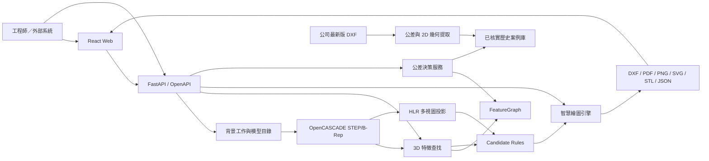
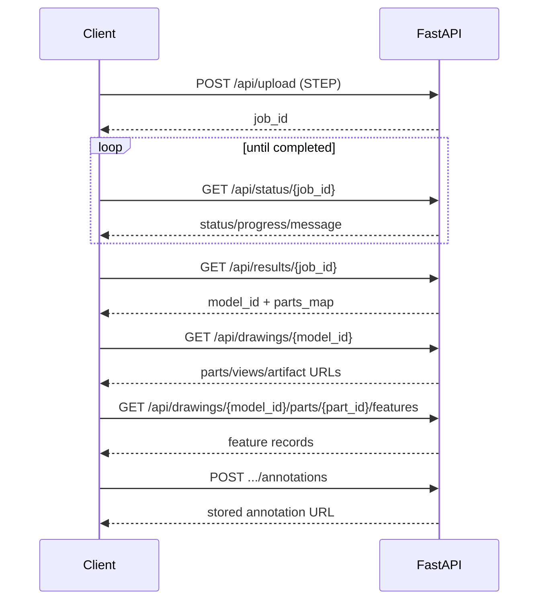

# FORCECON STEP-to-2D 智慧工程圖系統

將 STEP/STP 3D CAD 模型轉換成可檢視、可編輯、可交換的 2D 工程圖，並提供 3D 特徵查找、智慧標註、歷史公差案例檢索及公差推薦實驗平台。

> 專案狀態：工程原型持續開發中。STEP 解析、投影、DXF/PDF/PNG 輸出與智慧標註可使用；CAD-RAG 公差推薦仍在驗證資料品質與擴大可用案例覆蓋率，不應視為可直接取代工程師簽核的生產系統。

## 快速導覽

| 文件 | 用途 |
| --- | --- |
| [系統架構](docs/architecture.md) | 元件邊界、資料流、目錄與部署架構 |
| [特徵查找引擎](docs/feature-search-engine.md) | 3D FeatureGraph、2D DXF 推定與跨視圖策略 |
| [公差推薦系統](docs/tolerance-recommendation.md) | CAD-RAG、Tier 1～3、證據資格與目前限制 |
| [公差推薦 Benchmark](docs/tolerance-benchmark.md) | 防資料洩漏切分、來源重播、檢索與推薦評估指標 |
| [外部神經模型接入](docs/external-tolerance-model-api.md) | 獨立 AI 公差預測提交、解釋欄位與工程師來源選擇 |
| [繪圖與標註引擎](docs/drawing-engine.md) | HLR、視圖、規則、排版及輸出管線 |
| [網站頁面與操作流程](docs/web-pages.md) | 首頁、模型工作區、公差檢視器及頁面關係 |
| [完整 API 文件](docs/api_reference.md) | 所有 REST API、欄位、錯誤碼與對接流程 |
| [工程圖交換 API](docs/drawing_exchange_api.md) | 外部標註／公差服務的建議交換契約 |
| [Docker 部署](docs/deployment-docker.md) | Conda/PythonOCC 容器、Volume 與健康檢查 |
| [開發現況與路線圖](docs/development-status.md) | 已完成、進行中、已知限制與下一階段 |
| [更新日誌](CHANGELOG.md) | 依版本整理的重要功能與相容性變更 |

執行中的後端也提供：

- Swagger UI：`http://localhost:8000/docs`
- ReDoc：`http://localhost:8000/redoc`
- OpenAPI JSON：`http://localhost:8000/openapi.json`
- 健康檢查：`http://localhost:8000/api/health`

## 系統能力

### STEP/STP 與組合件處理

- 透過 OpenCASCADE/pythonocc-core 讀取 STEP/STP。
- 解析組合件樹，輸出組合件與個別零件 STEP/STL。
- 產出 `assembly_tree.json` 與前端可載入的 `parts_map`。
- 支援既有模型重新載入，不必每次重新處理 STEP。

### 3D 特徵查找

- 使用 B-Rep 拓撲面與曲面類型辨識圓柱、孔、軸段、端面、圓角、倒角、槽與外形包絡。
- 使用 `Bnd_Box`、曲面軸向與模型實際範圍動態定位，不依賴特定模型的寫死座標。
- 建立 FeatureGraph，記錄特徵類型、公稱尺寸、鄰接特徵、軸向區間與功能角色。
- 將特徵轉成前端 Three.js 可繪製的空間包絡框與選取記錄。

### 2D 工程圖生成

- OpenCASCADE HLR 產生前、後、上、右、左視圖的可見線與隱藏線。
- `SmartRuleExtractor` 將 3D 特徵轉成候選尺寸規則。
- `SmartDimensionEngine` 將工程師選定的規則投影至指定視圖。
- `LayoutEngine` 處理基線、串聯、直徑、極座標、引線、中心線與文字避讓。
- 輸出 DXF、向量 PDF、PNG、SVG、STL 與特徵 JSON。

### 智慧標註工作區

- 3D 模型、特徵包絡框與標註規則雙向高亮。
- 各特徵可指定前視、俯視、右視等多個標註視圖。
- 支援公差、前綴、標註側向、啟用狀態與樣板管理。
- 可回復建議預設、產出客製工程圖、下載 DXF、檢視 PDF/SVG。

### 歷史公差資料與 CAD-RAG（開發中）

- 從公司 DXF 原生 `DIMENSION` entity 提取公稱尺寸、明確公差、位置與來源 handle。
- 歷史版次依 `料號-RNN` 僅保留最高 R 版。
- 完全相同值、公差及量測端點的重複 entity 才會合併。
- 2D 規則引擎以圓輪廓、尺寸附著、可見／隱藏線與跨視圖證據推定特徵類型。
- 除同名／同版配對外，會展開 STEP/XCAF 所有葉零件，對全部 DXF 獨立視圖做不依賴檔名的全域幾何搜尋。
- 全域搜尋先以旋轉、鏡射及比例不變描述子取得 Top-K，再以 HLR、ICP／Chamfer、互為最佳與競爭分差核實配對。
- 配對後仍須通過尺寸附著、局部語意、STEP 投影、視圖輪廓及 3D 特徵位置，才會成為可推薦案例。
- 未核實案例可以展示與覆核，但不會自動進入 RAG 推薦決策。

目前資料庫重建基準：

| 指標 | 數量 |
| --- | ---: |
| 最新版 DXF 圖面（A/R 系列只留最高版） | 786 |
| 含有效公差案例的圖面 | 742 |
| 有效尺寸／公差證據 | 7,176 |
| 通過 DXF 附著＋STEP 投影／局部拓撲＋特徵位置核實、可參與 RAG | 20 |
| 2D 高信心推定（不直接進 RAG） | 22 |
| 2D 待覆核候選 | 541 |

完整方法、資格與風險請讀[公差推薦系統](docs/tolerance-recommendation.md)。

### 新舊模型比較

- 上傳舊版與新版 STEP。
- 顯示新版綠色、舊版紅色及線框／透明滑桿檢視。
- 回傳體積、表面積、包絡盒與組合件樹差異。
- 現行模式是快速視覺／統計比較，不承諾精準 Boolean added/removed solid。

## 整體架構



更完整的元件與部署圖請見[系統架構](docs/architecture.md)。

## 主要目錄

```text
step-to-2d-generator/
├── auto_2d_drawing/
│   ├── batch_generate.py              # Web 背景批次產圖入口
│   ├── step_reader.py                 # STEP、組合件與 STL
│   ├── feature_extractor.py           # 3D B-Rep 幾何特徵
│   ├── feature_layer.py               # 3D 特徵視覺記錄
│   ├── feature_graph.py                # FeatureGraph 相容入口
│   ├── view_projector.py               # OpenCASCADE HLR 投影
│   ├── dimension_engine.py             # 受保護的舊版標註引擎
│   ├── smart_extractors/
│   │   └── smart_rule_engine.py        # 新版候選規則與智慧標註
│   ├── layout_engine.py                # 尺寸排版與碰撞避讓
│   ├── dxf_drawer.py                   # DXF 圖層與幾何繪製
│   ├── pdf_exporter.py                 # PDF/PNG/SVG 輸出
│   └── tolerance/
│       ├── feature_graph.py            # 公差檢索使用的特徵圖
│       ├── tolerance_decision_service.py
│       ├── case_base.py
│       ├── dxf_tolerance_extractor.py
│       ├── dxf_structure_2d.py
│       ├── feature_inference_2d.py
│       ├── assembly_components.py      # XCAF 葉零件與幾何 fingerprint
│       ├── global_geometry_search.py   # 全域 3D 元件／DXF 視圖搜尋
│       ├── projection_registration_v2.py
│       ├── projection_geometry_verifier.py
│       ├── topology_feature_mapper.py
│       └── ingest_historical_data.py
├── web_app/
│   ├── backend/server.py               # FastAPI 與靜態前端
│   └── frontend/
│       ├── src/App.tsx                 # 主工作區
│       └── public/tolerance-inspector.html
├── docs/                               # 對外與維護文件
├── tests/                              # 公差管線與檢索測試
├── Dockerfile                          # Node + Conda 多階段映像
├── docker-compose.yml
├── environment.yml                     # Windows/本機 Conda 環境快照
└── environment.docker.yml              # Linux 容器最小 Conda 規格
```

## 本機安裝與啟動

### Windows / 現有 Conda 環境

本專案目前的 OpenCASCADE 環境名稱為 `pyoccenv`。若電腦以 PowerShell helper 設定 Conda：

```powershell
enable-conda
conda activate pyoccenv
```

第一次建立環境：

```powershell
conda env create -f environment.yml
conda activate pyoccenv
```

前端開發／重建：

```powershell
cd web_app/frontend
npm ci
npm run build
```

開發模式 `npm run dev` 已代理 `/api` 與 Inspector 到 `http://127.0.0.1:8000`；若後端在其他位置，改設 `VITE_API_BASE_URL`。

啟動整合式服務：

```powershell
cd D:\School\力致\app\step-to-2d-generator
python -m uvicorn web_app.backend.server:app --host 0.0.0.0 --port 8000
```

入口：

- 首頁：`http://localhost:8000/`
- 公差案例檢視器：`http://localhost:8000/tolerance-inspector.html`
- API 文件：`http://localhost:8000/docs`

### Docker Compose

```powershell
$env:CAD_COMPANY_DATA_DIR = 'D:\School\力致\力致_ref'
docker compose up --build
```

容器內使用獨立的 Conda `pyoccenv`，不需要執行 Windows 的 `enable-conda`。詳細 Volume、字型、健康檢查與疑難排解見[Docker 部署](docs/deployment-docker.md)。

## API 對接最短流程



對接前務必閱讀[完整 API 文件](docs/api_reference.md)，特別是：

- Job 目前存在記憶體，後端重啟後 `job_id` 失效。
- `model_id` 是輸出資料夾 ID，不等於 `job_id`。
- 三視圖與輸出格式應依 API 實際回傳判斷。
- 公差推薦回傳的證據具有 `used_for_decision` 與驗證狀態，不可只看相似度。
- `open-local` 是 Windows 本機便利功能，不適用一般容器或遠端整合。

## 工程規則

- 不修改受保護的 `dimension_engine.py` 與舊版 `extractors/`；新功能進入 `smart_extractors/` 或獨立模組。
- 不寫死特定模型的 3D 座標；以 `Bnd_Box`、主軸與拓撲動態計算。
- UI 採 `#171717`、`#262626`、`#2563eb` 工業 CAD 色系，不使用裝飾性 Emoji 或漸層背景。
- 未核實的 2D 公差特徵不得直接成為 RAG 決策依據。
- API 變更必須同步更新 `docs/api_reference.md`、OpenAPI 描述與 `CHANGELOG.md`。

## 測試與驗證

```powershell
python -m unittest discover -s tests
python -m py_compile web_app/backend/server.py auto_2d_drawing/config.py
```

前端：

```powershell
cd web_app/frontend
npm run build
npm run lint
```

容器：

```powershell
docker compose config
docker compose build
docker compose up -d
curl http://localhost:8000/api/health
```

## 授權與資料注意事項

程式庫不應提交客戶 STEP、DWG、DXF、PDF、產圖輸出或本機快取。公司圖面應以受控 Volume 掛載；對外分享映像前，需確認 `feature_case_base.json` 等衍生資料是否符合公司的資料治理與保密政策。
