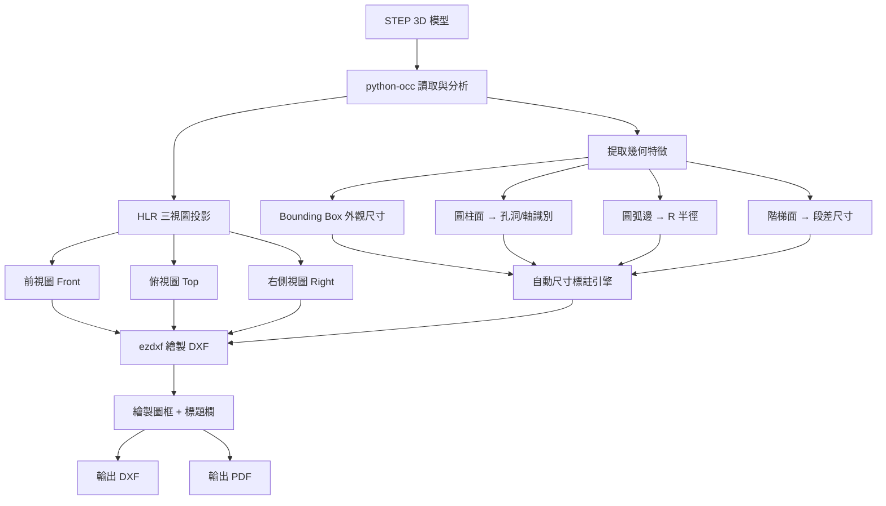

# 自動 2D 工程圖繪製系統 — 任務進度追蹤

> **專案目標**：讀取 3D STEP 模型 → 自動產生符合 FORCECON 力致科技標準的 2D 工程圖 (DXF/PDF)
> **測試模型**：BLADE_ASSY-1AC085000H-R01.stp
> **建立日期**：2026-05-22

---

## 動作流程總覽



---

## 階段一：環境與基礎設施

- [x] 建立 `auto_2d_drawing` 資料夾
- [x] 建立 `output` 子目錄 (輸出結果)
- [x] 建立 `reference` 子目錄 (業主範例參考)
- [x] 撰寫業主圖面標準分析報告
- [x] 撰寫本任務清單
- [x] 確認 conda 環境 `pyoccenv` 可用 (需安裝 pythonocc-core)
- [x] 安裝 ezdxf 到環境中 (`pip install ezdxf matplotlib`)

---

## 階段二：3D 特徵提取模組 (python-occ)

### 2.1 STEP 讀取與組合樹拆解
- [x] 建立 `step_reader.py` — STEP 檔案讀取器
  - [x] 讀取單一零件 STEP
  - [x] 讀取組合件 STEP (XDE 拆解)
  - [x] 自動匯出各零件的獨立 STEP

### 2.2 幾何特徵提取器
- [x] 建立 `feature_extractor.py` — 幾何特徵提取
  - [x] Bounding Box 計算 (L × W × H)
  - [x] 圓柱面識別 → 區分 Hole (法向內) vs Shaft (法向外)
  - [x] 圓柱面參數提取：半徑 R、中心座標 (cx, cy, cz)、軸方向、長度
  - [x] 圓弧邊識別 → 圓角/倒角 R 值
  - [ ] 階梯面偵測 → 各段長度
  - [x] 特徵資料輸出為 JSON 結構

### 2.3 測試驗證
- [x] 使用 BLADE_ASSY-1AC085000H-R01.stp 測試提取
- [x] 驗證孔洞/軸的分類是否正確
- [x] 驗證尺寸數值是否與業主圖面吻合

---

## 階段三：HLR 三視圖投影模組 (python-occ)

### 3.1 投影引擎
- [x] 建立 `view_projector.py` — 三視圖投影器
  - [x] 前視圖投影 (Front: Z 方向看)
  - [x] 俯視圖投影 (Top: Y 方向看)
  - [x] 右側視圖投影 (Right: -X 方向看)
  - [x] 可見邊 (VCompound) 提取
  - [x] 隱藏邊 (HCompound) 提取

### 3.2 邊緣分類
- [x] 直線 (Line) → (p1, p2)
- [x] 圓弧 (Circle) → (center, radius, points)
- [x] 曲線 (Spline) → 離散化點集
- [x] 各邊緣的 Bounding Box 計算

---

## 階段四：DXF 繪圖引擎 (ezdxf)

### 4.1 DXF 文件設定
- [x] 建立 `dxf_drawer.py` — DXF 繪圖核心
  - [x] 圖層系統設定 (VISIBLE, HIDDEN, CENTER, DIM, BORDER, TEXT)
  - [x] 線型定義 (Continuous, DASHED, CENTER)
  - [x] 標註樣式 (DimStyle) 設定
  - [x] 中文字型 (微軟正黑體) 設定

### 4.2 三視圖繪製
- [x] 可見輪廓繪製 (實線)
- [x] 隱藏線繪製 (虛線)
- [x] 中心線繪製 (紅色長虛線)
- [x] 自動比例計算 → 適配 A3 圖框
- [x] 三視圖佈局 (第三角投影法)

### 4.3 尺寸標註引擎
- [x] 建立 `dimension_engine.py` — 自動標註
  - [x] 外觀線性尺寸 (L, W, H)
  - [x] 直徑標註 (Ø / ψ)
  - [ ] 半徑標註 (R)
  - [x] 公差標註 (±值 或 +上偏差/-下偏差)
  - [ ] 倒角標註 (C)
  - [/] 標註位置自動安排 (防碰撞) — 基礎間距已完成，進階防碰撞待做
  - [x] 引線 (Leader) 繪製
  - [x] 管制代號系統 (A)(B)(C)...

### 4.4 圖框與標題欄
- [x] 建立 `title_block.py` — FORCECON 標準圖框
  - [x] A3 外框繪製 (含等分區域 8×4)
  - [x] 版次欄 (REVISIONS)
  - [x] 標題欄 (RANGE/TOLERANCE + MODEL + TITLE + SCALE...)
  - [x] 一般公差表
  - [ ] FAI/CPK 管制表 (預留)
  - [ ] NOTES 區域

---

## 階段五：PDF 輸出模組

- [x] 建立 `pdf_exporter.py`
  - [x] matplotlib 後端渲染
  - [ ] 白底黑線 (適合列印) — 目前為暗色 CAD 風格
  - [x] A3 / A4 紙張支援
  - [x] 中文字型嵌入

---

## 階段六：主流程整合

- [x] 建立 `main.py` — 主程式入口
  - [x] 單一零件模式：指定 STEP → 產生工程圖
  - [ ] 組合件模式：自動拆解 → 批次產生工程圖
  - [ ] 命令列參數支援 (料號、品名、版次、材質)

- [x] 建立 `config.py` — 配置參數
  - [x] 圖面尺寸設定
  - [x] 公差預設值
  - [x] 輸出路徑

---

## 階段七：驗證與測試

### 7.1 單一零件測試
- [x] BLADE_ASSY-1AC085000H-R01.stp → 產生三視圖
- [x] 檢查外觀尺寸是否正確 (✓ 111.40, 37.60, 7.50 等均吻合業主圖)
- [x] 檢查孔洞/軸標註是否正確 (✓ 82孔洞/37軸 正確分類)
- [x] 檢查圖框與標題欄格式 (✓ FORCECON 標準格式)
- [x] 與業主範例圖比對 (✓ 基本佈局正確，標註數值吻合)

### 7.2 多零件測試
- [x] 拆解組合件 → 逐一零件出圖 (批次處理已完成，可自動生成資料夾)
- [x] 檢查批次輸出一致性 (使用 BLADE_ASSY-1AC085000H-R01 測試通過)
- [x] 測試其他模型: M24122-3D-R00.stp 批次處理中

### 7.3 輸出格式驗證
- [x] DXF 可在 AutoCAD / LibreCAD 中正確開啟
- [x] PDF 清晰可列印
- [x] 中文顯示正確

---

## 檔案結構規劃

```
auto_2d_drawing/
│
├── main.py                     # 主程式入口
├── config.py                   # 配置參數
│
├── step_reader.py              # STEP 讀取 + 組合樹拆解 (python-occ)
├── feature_extractor.py        # 3D 幾何特徵提取 (python-occ)
├── view_projector.py           # HLR 三視圖投影 (python-occ)
│
├── dxf_drawer.py               # DXF 繪圖核心 (ezdxf)
├── dimension_engine.py         # 自動尺寸標註引擎 (ezdxf)
├── title_block.py              # FORCECON 標準圖框 (ezdxf)
├── pdf_exporter.py             # PDF 輸出 (matplotlib)
│
├── 業主圖面標準分析報告.md      # 業主格式分析
├── 任務進度.md                  # 本檔案 — 進度追蹤
│
├── output/                     # 工程圖輸出
├── reference/                  # 業主範例參考圖
│
└── tests/                      # 測試腳本 (未來擴充)
```

---

## 執行環境

```bash
# 啟動 conda 環境
conda activate pyoccenv

# 安裝額外套件 (如果尚未安裝)
pip install ezdxf matplotlib numpy

# 執行主程式 (未來)
cd C:\MCAS_LAB\力致\app\auto_2d_drawing
python main.py --input ../models/BLADE_ASSY-1AC085000H-R01.stp --output ./output/
```

---

## 備註

- python-occ 負責所有 3D 幾何運算 (讀檔、HLR 投影、特徵提取)
- ezdxf 負責所有 2D 圖面繪製 (DXF 生成、標註、圖框)
- 兩者都需要 `pyoccenv` conda 環境來運行
- 先以 BLADE_ASSY 進行原型開發，確認流程正確後再擴展至其他零件
