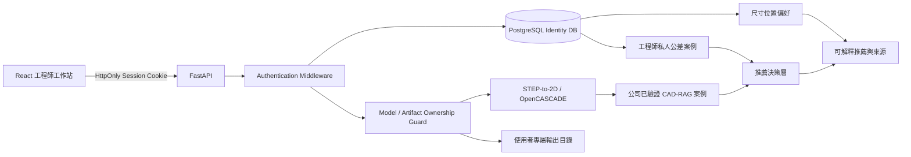

# 工程師帳號、資料隔離與個人化公差推薦系統

## 1. 目標與範圍

本系統提供工程師登入、登出、修改密碼、管理員帳號管理，以及模型、標註成品、標註範本和個人案例的資料隔離。管理員可跨帳號稽核；一般工程師只能讀取自己的資料。公司歷史 CAD-RAG 案例維持共享唯讀，私人標註案例只會影響原工程師的推薦。

目前不取代公司 AD/LDAP。若未來已有 Microsoft Entra ID、ADFS 或 LDAP，可將登入層換成 OIDC/SAML，內部仍以 `users.id` 作為資料擁有者識別碼。

## 2. 架構



推薦流程不會把私人案例寫進公司案例 JSON，也不會讓其他工程師檢索私人資料。

## 3. 資料庫選擇

### 正式環境：PostgreSQL

中型公司建議 PostgreSQL：它支援多使用者交易、可靠備份、Point-in-Time Recovery、複寫、稽核整合，並適合未來的 JSON/向量資料。Docker Compose 已提供 PostgreSQL 17，應用程式透過 `CAD_DATABASE_URL` 連線。

### 開發環境：SQLite

未設定 `CAD_DATABASE_URL` 時，系統建立 `web_app/backend/data/forcecon_identity.db`。SQLite 適合單機開發和測試，不建議放在 NAS 上供多台後端共同寫入。

## 4. 資料模型

| 資料表 | 用途 | 隔離欄位 |
|---|---|---|
| `users` | 帳號、角色、狀態、密碼雜湊 | `id` |
| `sessions` | 可撤銷登入工作階段 | `user_id` |
| `engineer_preferences` | 推薦、標註與 UI 偏好 | `user_id` |
| `owned_models` | 模型與輸出目錄擁有者 | `owner_user_id` |
| `annotation_artifacts` | 標註輸入快照與輸出連結 | `owner_user_id` |
| `engineer_tolerance_cases` | 私人公差、特徵與位置案例 | `owner_user_id` |
| `engineer_templates` | 個人標註範本 | `owner_user_id` |
| `audit_events` | 管理操作與作品事件 | `actor_user_id` |

所有私人資料查詢都由 session 內的 `user_id` 加入條件；不信任前端傳入的 owner ID。

## 5. 權限矩陣

| 功能 | ENGINEER | ADMIN |
|---|---:|---:|
| 登入、登出、修改自己的密碼 | 可 | 可 |
| 查看公司歷史公差案例 | 可 | 可 |
| 查看自己的模型與標註成品 | 可 | 可 |
| 查看其他工程師模型與成品 | 不可 | 可 |
| 修改自己的偏好 | 可 | 可 |
| 使用自己的私人案例推薦 | 可 | 可 |
| 建立、停用、重設帳號 | 不可 | 可 |
| 寫入公司全域公差案例 | 不可 | 可 |
| 查看稽核紀錄 | 不可 | 可 |

工程師查詢不屬於自己的模型時回傳 `404`，避免洩漏其他工程師的模型名稱。

## 6. 認證安全

- 密碼：PBKDF2-HMAC-SHA256、隨機 128-bit salt、600,000 iterations。
- Session：384-bit 隨機 opaque token；資料庫只保存 SHA-256 token hash。
- Cookie：`HttpOnly`、`SameSite=Strict`，正式 HTTPS 設定 `CAD_COOKIE_SECURE=1`。
- 預設有效 12 小時；登出、停用、改密碼或重設密碼會撤銷 session。
- CORS 由 `CAD_CORS_ORIGINS` 明確設定，不使用萬用來源。
- API 預設要求登入；health、login 和使用獨立 API key 的外部模型寫入接口例外。
- 管理員操作寫入 `audit_events`。

第一個管理員由環境變數建立；資料庫已有帳號時不會覆蓋：

```env
CAD_ADMIN_USERNAME=admin
CAD_ADMIN_PASSWORD=<long-random-password>
CAD_ADMIN_DISPLAY_NAME=System Administrator
```

本機測試預設是 `admin / ForceconAdmin!2026`，首次登入必須改密碼，正式環境禁止使用此預設。

## 7. 私人檔案隔離

```text
auto_2d_drawing/output/{model_id}/
  _users/{user_uuid}/
    _annotations/
    _custom_annotations/{part_id}/
      {part_id}_custom.dxf
      {part_id}_custom.pdf
      {part_id}_custom.svg
      {part_id}_custom.png
```

`/api/files/{model_id}/...` 的請求會先經過 session 與 model ownership 檢查。未登記擁有者的舊模型只有管理員可讀取。

## 8. 個人化推薦

### 證據池

1. 公司證據池：原 `FeatureCaseBase`，含公司歷史圖面和已驗證 CAD-RAG 案例。
2. 個人證據池：`engineer_tolerance_cases`，只含目前登入工程師完成的標註。

系統先執行公司推薦，再執行個人化層。回應保留兩種來源，不能把私人偏好誤稱為公司標準。

### 個人案例相似度

```text
0.35 × feature_type
+ 0.20 × inferred_role
+ 0.30 × nominal_geometry
+ 0.10 × part_type
+ 0.05 × product_family
```

名義尺寸使用相對誤差指數衰減；不同特徵類別不會因尺寸接近而得到高分。

### 推薦模式

- `BALANCED`：公司推薦仍是主結果，顯示個人案例和位置建議。
- `PERSONAL_FIRST`：私人案例高於設定門檻時，成為 `TIER_0_ENGINEER_PREFERENCE`。
- `COMPANY_ONLY`：完全不載入私人案例。

私人證據標記：

```json
{
  "source_scope": "PERSONAL_ENGINEER",
  "verification_status": "ENGINEER_CONFIRMED_PRIVATE",
  "confidence_basis": "ENGINEER_PRIVATE_HISTORY_UNCALIBRATED"
}
```

## 9. 尺寸位置偏好

標註完成時記錄 `preferred_view`、`views`、`target_views`、`side`、`sides`、`baseline`、`offset`、`rank` 及 `geometry_payload`。同類特徵再次推薦時以相似案例多數決；offset 使用平均值。尚無歷史時使用偏好設定頁的預設。

```json
{
  "engineer_placement_recommendation": {
    "preferred_view": "front",
    "side": "BOTTOM",
    "baseline": "LEFT",
    "offset": 12.0,
    "support_count": 4,
    "source": "ENGINEER_HISTORY"
  }
}
```

第二階段建議把位置正規化成相對投影 bounding box 的比例座標，而不是只保存絕對 mm，才能跨不同尺寸零件轉移習慣。

## 10. API

### 認證

| Method | Path | 說明 |
|---|---|---|
| POST | `/api/auth/login` | 登入並設定 HttpOnly Cookie |
| POST | `/api/auth/logout` | 撤銷目前 session |
| GET | `/api/auth/me` | 目前帳號 |
| PUT | `/api/auth/password` | 修改密碼並撤銷所有 session |

### 工程師

| Method | Path | 說明 |
|---|---|---|
| GET/PUT | `/api/engineer/preferences` | 個人推薦與標註偏好 |
| DELETE | `/api/engineer/preferences` | 恢復預設偏好，不刪歷史案例與成品 |
| GET | `/api/engineer/artifacts` | 自己的成品；管理員可加 owner filter |
| DELETE | `/api/engineer/artifacts/{id}` | 刪除成品 metadata 和私人案例 |
| GET | `/api/engineer/tolerance-cases` | 自己的私人案例 |
| DELETE | `/api/engineer/tolerance-cases/{id}` | 刪除自己的單筆學習案例 |
| DELETE | `/api/engineer/tolerance-cases` | 清空自己的學習案例，不刪成品 |

### 管理員

| Method | Path | 說明 |
|---|---|---|
| GET/POST | `/api/admin/users` | 列出或建立帳號 |
| PATCH | `/api/admin/users/{id}` | 名稱、角色、啟用狀態 |
| POST | `/api/admin/users/{id}/reset-password` | 重設密碼並撤銷 session |
| GET | `/api/admin/audit-events` | 稽核事件 |

完整 schema 可在 `/docs` 和 `/openapi.json` 查閱。

## 11. Docker 公司部署

```powershell
Copy-Item .env.example .env
# 修改 .env 的 PostgreSQL 與管理員密碼
docker compose up -d --build
```

正式網域：

```env
CAD_COOKIE_SECURE=1
CAD_CORS_ORIGINS=https://cad.company.example
```

建議拓撲：

```text
Users -> HTTPS Reverse Proxy -> FastAPI containers -> PostgreSQL
                                  |
                                  +-> Shared CAD output storage
                                  +-> Read-only company reference drawings
```

必須一起備份 PostgreSQL 與 `/data/output`，避免作品 metadata 與檔案不一致。OpenCASCADE 工作較重，中型公司第二階段應使用工作佇列，Web API 只處理排程、權限和結果查詢。

## 12. 上線驗收

- HTTPS Secure Cookie 與 CORS 測試。
- PostgreSQL 備份、還原演練。
- 管理員／工程師越權測試。
- 兩位工程師同特徵不同公差，確認私人推薦互不污染。
- 使用 `1AL0W5000H-R03` 執行 STEP→2D→推薦→標註保存→再次推薦。
- 分別 benchmark `COMPANY_ONLY`、`BALANCED`、`PERSONAL_FIRST`。
- 第二階段導入 Alembic migration、OIDC/AD、工作佇列和 object storage。
