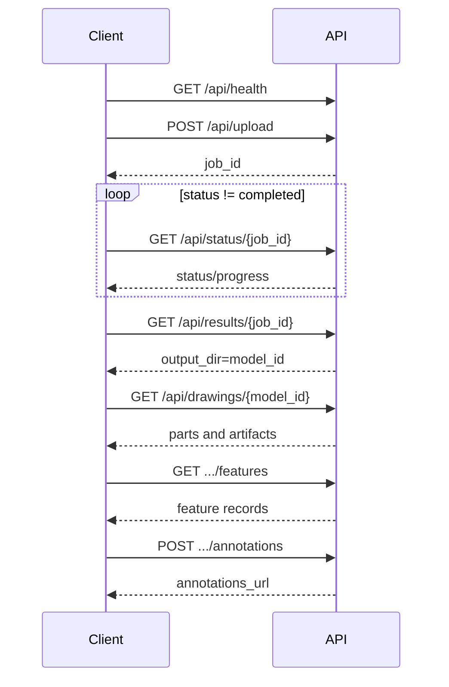

# FORCECON STEP-to-2D REST API Reference

本文件是外部系統對接的主要契約說明。執行中的 FastAPI 會同步提供 `/docs`、`/redoc` 與 `/openapi.json`；若文件與部署版本不一致，先確認後端回傳的 `info.version` 與 Git commit。

## 1. 基本資訊

| 項目 | 值 |
| --- | --- |
| 預設 Base URL | `http://localhost:8000` |
| API Prefix | `/api` |
| JSON | `application/json; charset=utf-8` |
| 檔案上傳 | `multipart/form-data` |
| OpenAPI | `/openapi.json` |
| Swagger UI | `/docs` |
| ReDoc | `/redoc` |
| 目前 API 版本 | `0.4.0-dev` |

除檔案下載／PDF／SVG 外，成功回應為 JSON。日期時間若新增，應使用 ISO 8601 UTC。

## 2. ID 與名詞

### `job_id`

上傳或比較任務的 UUID，只用於查詢當次執行狀態。Job 目前儲存在記憶體，後端重啟即失效。

### `model_id`

產圖輸出資料夾名稱，通常是 `/api/results/{job_id}` 的 `output_dir`，例如 `BLADE_ASSY-R01_batch`。不是 job UUID。

### `part_id`

組合件中的零件 ID，例如 `_full_assembly`、`Part_1`。請從 `parts_map` 或 drawing package 取得，不要自行猜測。

### `model_name`

公差來源圖面的檔名 stem，例如 `0AJ0A00009-R03`，不含 `.dxf`。

### `rule_id`

候選標註規則 ID。公差推薦的 recommendations object 通常以此作 key。

## 3. 共通錯誤格式

FastAPI 錯誤：

```json
{
  "detail": "Model output not found"
}
```

常見狀態：

| HTTP | 意義 |
| ---: | --- |
| 200 | 成功 |
| 400 | 參數或狀態不合法，例如 job 未完成 |
| 401 | 受保護接口缺少或提供錯誤 API key |
| 404 | job、model、part、圖面或 artifact 不存在 |
| 422 | FastAPI schema 驗證或 DXF 解析失敗 |
| 500 | CAD 計算、檔案或未處理例外 |

目前沒有統一的錯誤 `code`；整合端不應解析 `detail` 文字來決定商業流程。

## 4. API 總表

### 系統

| Method | Path | 用途 |
| --- | --- | --- |
| GET | `/api/health` | Liveness 與部署路徑 |

### Job 與模型

| Method | Path | 用途 |
| --- | --- | --- |
| POST | `/api/upload` | 上傳 STEP/STP 並建立產圖 job |
| POST | `/api/compare` | 上傳 old/new STEP 並建立比較 job |
| GET | `/api/status/{job_id}` | 查詢 job |
| GET | `/api/results/{job_id}` | 取得完成結果 |
| GET | `/api/models` | 列出既有模型輸出 |
| GET | `/api/model/{model_id}` | 讀取既有模型與 parts map |

### 工程圖交換

| Method | Path | 用途 |
| --- | --- | --- |
| GET | `/api/drawings/{model_id}` | 正規化工程圖套件 |
| GET | `/api/drawings/{model_id}/parts/{part_id}/features` | 讀取已輸出的 feature records |
| GET | `/api/drawings/{model_id}/parts/{part_id}/annotations` | 讀取外部標註 |
| POST | `/api/drawings/{model_id}/parts/{part_id}/annotations` | 儲存外部標註 |
| GET | `/api/files/{path}` | 靜態 artifact |

### 即時特徵與智慧標註

| Method | Path | 用途 |
| --- | --- | --- |
| GET | `/api/features/{model_id}/{part_id}` | 從 STEP 即時提取 3D 特徵 |
| GET | `/api/annotation/candidate-rules/{model_id}/{part_id}` | 產生候選標註規則 |
| GET | `/api/annotation/templates` | 列出樣板 |
| POST | `/api/annotation/templates` | 儲存樣板 |
| DELETE | `/api/annotation/templates/{template_id}` | 刪除樣板 |
| POST | `/api/annotation/apply-template` | 套用樣板到 records |
| POST | `/api/annotation/render` | 產出客製工程圖 |

### 公差案例與推薦

| Method | Path | 用途 |
| --- | --- | --- |
| GET | `/api/tolerance/stats` | 案例庫統計 |
| GET | `/api/tolerance/cases` | 案例／圖面清單 |
| GET | `/api/tolerance/drawing-details/{model_name}` | 圖面內全部尺寸與公差 |
| GET | `/api/tolerance/drawing-svg/{model_name}` | SVG，可 highlight handle |
| GET | `/api/tolerance/drawing-pdf/{model_name}` | Inline PDF |
| GET | `/api/tolerance/download/{model_name}` | 下載 DWG/DXF |
| POST | `/api/tolerance/open-local` | Windows 本機開啟圖面 |
| POST | `/api/tolerance/recommend` | Tier 1～3 公差推薦 |
| POST | `/api/tolerance/external-predictions/{model_id}/{part_id}` | 提交外部神經網路預測批次 |
| GET | `/api/tolerance/external-predictions/{model_id}/{part_id}` | 讀取目前預測批次 |
| DELETE | `/api/tolerance/external-predictions/{model_id}/{part_id}` | 移除目前預測批次 |
| POST | `/api/tolerance/save-case` | 保存工程師確認案例 |

### 參考資料與相容 API

| Method | Path | 用途 |
| --- | --- | --- |
| GET | `/api/examples` | 公司範例樹 |
| GET | `/api/processed/fan-20260625` | 指定批次結果 |
| GET | `/api/tolerances` | 讀取全域暫存公差 |
| POST | `/api/tolerances` | 更新全域暫存公差 |

## 5. 系統 API

### `GET /api/health`

不執行 CAD 工作，供 Docker/Kubernetes liveness 使用。

```json
{
  "status": "ok",
  "service": "forcecon-step-to-2d",
  "version": "0.4.0-dev",
  "models_dir": "/data/models",
  "output_dir": "/data/output"
}
```

此 endpoint 只表示 Web 程序活著，不保證 OpenCASCADE 能成功處理任意模型。正式環境可另建 readiness smoke test。

## 6. 上傳與 Job

### `POST /api/upload`

Request：

```http
POST /api/upload
Content-Type: multipart/form-data
```

| Form field | Type | Required | 說明 |
| --- | --- | --- | --- |
| `file` | file | yes | `.stp` 或 `.step` |

Response：

```json
{"job_id": "4e1179f6-69f0-4d16-8c60-3d54539fa4e2"}
```

目前 API 沒有檔案大小上限與認證；部署在不可信網路前必須由 reverse proxy 補上限制。

### `POST /api/compare`

| Form field | Type | Required |
| --- | --- | --- |
| `file_old` | STEP file | yes |
| `file_new` | STEP file | yes |

Response 同 upload。現在採快速視覺比較：`added` 是完整新模型，`removed` 是完整舊模型，不是 Boolean 差集。

### `GET /api/status/{job_id}`

```json
{
  "status": "processing",
  "message": "正在處理 Part_1 (1/5)",
  "progress": {"current": 1, "total": 5},
  "logs": []
}
```

`status`：`processing`、`completed`、`error`。

建議輪詢：前幾次每 1 秒，長任務退避至 2～5 秒；收到 404 代表 job 不存在或服務曾重啟。

### `GET /api/results/{job_id}`

Job 必須 completed，否則 400。

```json
{
  "tree": {"name": "Assembly", "children": []},
  "parts_map": {
    "_full_assembly": {
      "pdf": "/api/files/M_batch/M_assembly.pdf",
      "png": "/api/files/M_batch/M_assembly.png",
      "dxf": "/api/files/M_batch/M_assembly.dxf",
      "stl": "/api/files/M_batch/_parts/_full_assembly.stl",
      "front_pdf": "/api/files/M_batch/M_assembly_front.pdf",
      "features_json": "/api/files/M_batch/M_assembly_feature_records.json"
    }
  },
  "output_dir": "M_batch",
  "diff_result": null,
  "stats": null,
  "tree_old": null,
  "tree_new": null
}
```

Compare job 主要使用 `diff_result`、`stats`、`tree_old`、`tree_new`。

### `GET /api/models`

列出 output 下以 `_batch` 結尾的資料夾。

```json
{"models": [{"id": "M_batch", "name": "M"}]}
```

### `GET /api/model/{model_id}`

```json
{
  "tree": {},
  "parts_map": {},
  "output_dir": "M_batch"
}
```

## 7. 工程圖交換 API

### `GET /api/drawings/{model_id}`

建議外部系統從此 endpoint 取得模型可用的 part、主圖、視圖與 feature artifact。

```json
{
  "model_id": "M_batch",
  "output_dir": "M_batch",
  "tree": {},
  "parts": {
    "_full_assembly": {
      "part_id": "_full_assembly",
      "main": {
        "pdf": "/api/files/M_batch/M_assembly.pdf",
        "png": "/api/files/M_batch/M_assembly.png",
        "dxf": "/api/files/M_batch/M_assembly.dxf",
        "stl": "/api/files/M_batch/_parts/_full_assembly.stl"
      },
      "views": {
        "front": {"pdf": "/api/files/M_batch/M_assembly_front.pdf"},
        "top": {"pdf": "/api/files/M_batch/M_assembly_top.pdf"}
      },
      "feature_layer": {
        "pdf": "/api/files/M_batch/M_assembly_features_view.pdf",
        "json": "/api/files/M_batch/M_assembly_feature_records.json"
      },
      "external_annotations": null
    }
  }
}
```

Client 必須 feature-detect 欄位，不假設每個 part 一定有全部視圖或格式。

### `GET /api/drawings/{model_id}/parts/{part_id}/features`

讀取已產生的 feature record JSON，不重新跑 STEP。

```json
{
  "model_id": "M_batch",
  "part_id": "Part_1",
  "features_url": "/api/files/...json",
  "records": [
    {
      "id": "shaft_segment_01",
      "type": "shaft_segment",
      "name": "軸段 Φ10",
      "view": "front",
      "nominal": {"diameter": 10.0},
      "geometry": {},
      "source": {"extractor": "FeatureExtractor", "confidence": 0.9}
    }
  ]
}
```

### `POST /api/drawings/{model_id}/parts/{part_id}/annotations`

Body 是 JSON object，schema 目前寬鬆。建議：

```json
{
  "schema_version": "1.0",
  "source": "external-tolerance-service",
  "annotations": [
    {
      "feature_id": "shaft_segment_01",
      "view": "front",
      "type": "diameter",
      "nominal": 10.0,
      "label": "Φ10 h6",
      "tolerance": {"mode": "FIT", "fit_class": "h6"},
      "confidence": 0.94,
      "needs_review": false
    }
  ]
}
```

Response：

```json
{
  "status": "success",
  "message": "Annotations saved.",
  "model_id": "M_batch",
  "part_id": "Part_1",
  "annotations_url": "/api/files/M_batch/_annotations/Part_1_annotations.json"
}
```

### `GET .../annotations`

```json
{"model_id": "M_batch", "part_id": "Part_1", "annotations": {}}
```

沒有標註時回 404，不回空 object。

### `GET /api/files/{path}`

FastAPI StaticFiles，服務 `CAD_OUTPUT_DIR` 下的 artifact。請使用 API 回傳 URL，不自行拼接未驗證路徑。

## 8. 即時特徵與標註

### `GET /api/features/{model_id}/{part_id}`

從 output `_parts` 或 models 目錄尋找 STEP，動態提取 FeatureRecord。可能是 CPU 密集同步呼叫。

成功回應包含 model/part、part type、feature records 與幾何摘要；實際欄位請同時參考 OpenAPI 與 [特徵查找引擎](feature-search-engine.md)。

### `GET /api/annotation/candidate-rules/{model_id}/{part_id}`

重新載入 STEP、投影必要視圖並產生候選標註規則。

典型 response：

```json
{
  "status": "ok",
  "model_id": "M_batch",
  "part_id": "Part_1",
  "rules": [
    {
      "rule_id": "shaft_segment_01_diameter",
      "dim_type": "DIAMETER",
      "nominal_value": 10.0,
      "target_views": ["front", "top"],
      "views": ["front"],
      "enabled": true
    }
  ]
}
```

### `GET /api/annotation/templates`

```json
{"status": "ok", "templates": []}
```

### `POST /api/annotation/templates`

Body 傳完整 template object。TemplateManager 負責建立 ID／保存。回應：

```json
{"status": "ok", "template": {}}
```

### `DELETE /api/annotation/templates/{template_id}`

成功：

```json
{"status": "ok", "message": "Template deleted"}
```

內建／不存在 template 可能回 400/404。

### `POST /api/annotation/apply-template`

```json
{
  "template_id": "shaft-default",
  "feature_records": []
}
```

也可直接傳 `template` object。Response：

```json
{
  "status": "ok",
  "records": [],
  "applied_template": "Shaft Default"
}
```

### `POST /api/annotation/render`

```json
{
  "model_id": "M_batch",
  "part_id": "Part_1",
  "feature_records": [
    {
      "rule_id": "shaft_segment_01_diameter",
      "enabled": true,
      "views": ["front"],
      "tolerance_config": {"mode": "FIT", "fit_class": "h6"}
    }
  ],
  "title_info": {
    "drawing_no": "M-R01",
    "part_name": "SHAFT",
    "material": "SUS304"
  }
}
```

成功回應包含產生的 DXF/PDF/PNG/SVG URL 與 timestamp。這是同步 CAD 工作，reverse proxy timeout 應高於一般 API。

## 9. 公差案例 API

### `GET /api/tolerance/stats`

```json
{
  "status": "ok",
  "total_cases": 23516,
  "total_drawings": 1507,
  "roles": {},
  "verification": {"AUTO_EXTRACTED": 23502, "AUTO_VERIFIED": 14},
  "feature_linkage": {"FEATURE_LINKED": 14, "UNRESOLVED_FEATURE": 23502},
  "retrieval_eligible_cases": 14,
  "top_series": {}
}
```

`total_cases` 是尺寸／公差證據，不等於圖面數。

### `GET /api/tolerance/cases`

Query：

| Name | Type | Default | 說明 |
| --- | --- | --- | --- |
| `category` | string | null | `ALL` 或 UI 分類 |
| `search` | string | null | case/model/type/role/tolerance 搜尋 |
| `page` | int | 1 | 1-based |
| `page_size` | int | 36 | `<=0` 表示不分頁，不建議外部使用 |
| `group_by_drawing` | bool | false | true 時一張圖面一筆 |

Response：

```json
{
  "status": "ok",
  "total_count": 1507,
  "evidence_count": 23516,
  "all_cases_count": 23516,
  "group_by_drawing": true,
  "page": 1,
  "page_size": 36,
  "total_pages": 42,
  "cases": [
    {
      "model_name": "0AJ0A00009-R03",
      "drawing_case_count": 8,
      "drawing_verified_count": 0,
      "drawing_eligible_count": 0,
      "drawing_feature_types": ["shaft_segment", "hole"],
      "preview_image_url": "/api/tolerance/drawing-svg/0AJ0A00009-R03",
      "pdf_url": "/api/tolerance/drawing-pdf/0AJ0A00009-R03",
      "details_url": "/api/tolerance/drawing-details/0AJ0A00009-R03"
    }
  ]
}
```

### `GET /api/tolerance/drawing-details/{model_name}`

從來源 DXF 即時解析全部 dimension/text item。

```json
{
  "status": "ok",
  "model_name": "0AJ0A00009-R03",
  "has_dwg": true,
  "has_dxf": true,
  "svg_url": "/api/tolerance/drawing-svg/...",
  "pdf_url": "/api/tolerance/drawing-pdf/...",
  "total_dimensions_count": 15,
  "total_tolerances_count": 8,
  "tolerances": [
    {
      "nominal_value": 120.0,
      "dimension_category": "LINEAR",
      "formatted_tolerance": "(+0.500 / -0.500 mm)",
      "entity_handle": "31F88",
      "validation_status": "AUTO_VALIDATED",
      "feature_inference_2d": {}
    }
  ],
  "drawing_defaults": [],
  "rejected_items": [],
  "all_dimensions": []
}
```

### `GET /api/tolerance/drawing-svg/{model_name}`

Query `highlight` 可指定 DXF entity handle：

```text
/api/tolerance/drawing-svg/0AJ0A00009-R03?highlight=31F88
```

Response Content-Type：`image/svg+xml`。

### `GET /api/tolerance/drawing-pdf/{model_name}`

Response Content-Type：`application/pdf`；`Content-Disposition` 為 `inline`，可嵌入 iframe。

### `GET /api/tolerance/download/{model_name}`

Query：`format=dwg|dxf`，找不到指定格式時現行程式可能 fallback 到另一可用來源。Response 是 attachment。

### `POST /api/tolerance/open-local`

```json
{"model_name": "0AJ0A00009-R03", "format": "dwg"}
```

呼叫 Windows `os.startfile`，只適用與使用者同機的可信桌面部署。Docker/Linux、遠端服務與多租戶環境不應使用。

## 10. 公差推薦 API

### `POST /api/tolerance/recommend`

```json
{
  "model_id": "M_batch",
  "part_id": "Part_1",
  "part_category": "SHAFT",
  "product_family": "FQ6V",
  "candidate_rules": [
    {
      "rule_id": "shaft_segment_01_diameter",
      "dim_type": "DIAMETER",
      "nominal_value": 10.0,
      "feature_type": "shaft_segment"
    }
  ]
}
```

`model_id`、`part_id` 必填。省略 `candidate_rules` 時後端會重新建立候選規則。

Response：

```json
{
  "status": "ok",
  "model_id": "M_batch",
  "part_id": "Part_1",
  "part_type": "SHAFT",
  "product_family": "FQ6V",
  "total_rules": 12,
  "high_confidence_count": 2,
  "recommendations": {
    "shaft_segment_01_diameter": {
      "tier_level": "TIER_1_HISTORICAL",
      "recommended_mode": "FIT",
      "formatted_display": "h6",
      "confidence": 0.9,
      "reasoning": [],
      "retrieval_trace": {
        "decision_source": "HISTORICAL_CASE",
        "adopted_case_id": "HIST2_...",
        "retrieved_case_count": 3,
        "compatible_case_count": 1
      },
      "evidence_cases": [
        {
          "case_id": "HIST2_...",
          "source_model": "1FQ6V5000H-R01",
          "similarity": 0.91,
          "used_for_decision": true,
          "evidence_role": "ADOPTED_HISTORICAL_CASE",
          "has_source_drawing": true,
          "drawing_urls": {
            "pdf": "/api/tolerance/drawing-pdf/...",
            "svg": "/api/tolerance/drawing-svg/...",
            "details": "/api/tolerance/drawing-details/..."
          }
        }
      ]
    }
  },
  "feature_graph": {},
  "external_prediction_set": {
    "source_type": "EXTERNAL_NEURAL_MODEL",
    "provider": "tolerance-ml-service",
    "model_name": "ToleranceNet",
    "model_version": "2026.09.1",
    "predictions_by_rule": {}
  }
}
```

整合端必須使用 `retrieval_trace.decision_source` 與 `used_for_decision` 判定是否真正採用歷史案例；不能只因 `evidence_cases` 非空就宣稱使用案例。

`external_prediction_set` 與 `recommendations` 是兩個獨立來源；後端不會合併信心、投票或自動採用外部結果。沒有已提交預測時此欄位為 `null`。

### 外部神經網路預測 API

| Method | Endpoint | 語意 |
| --- | --- | --- |
| POST | `/api/tolerance/external-predictions/{model_id}/{part_id}` | 原子取代此零件目前整批預測 |
| GET | `/api/tolerance/external-predictions/{model_id}/{part_id}` | 讀回原始陣列及 `predictions_by_rule` 索引 |
| DELETE | `/api/tolerance/external-predictions/{model_id}/{part_id}` | 只移除外部預測，不影響 CAD-RAG 案例 |

POST 至少需要 `provider`、`model_name`、`model_version` 及一筆 prediction。每筆 prediction 必須包含唯一 `rule_id` 與 0～1 的 `confidence`；mode 必須是支援 enum，結構化 config 必須相符。後端固定拒絕不屬於目前 candidate rules 的 ID，呼叫端不能停用此檢查。模型版本、輸入特徵、不確定性、警告、完整 request/response 範例與上線驗收方式，請見[外部神經網路公差預測接入規格](external-tolerance-model-api.md)。

若後端設定 `CAD_EXTERNAL_PREDICTION_API_KEY`，三個 endpoint 都必須帶 `X-API-Key`。正式部署不可把空 key 的開發模式暴露到不可信網路。

### `POST /api/tolerance/save-case`

保存工程師已確認案例：

```json
{
  "case_id": "optional-client-id",
  "part_type": "SHAFT",
  "feature_type": "shaft_segment",
  "inferred_role": "BEARING_JOURNAL",
  "nominal_dimensions": {"diameter": 10.0, "length": 8.0},
  "neighbor_types": ["locating_shoulder"],
  "boundary_position": "INTERIOR",
  "tolerance_config": {"mode": "FIT", "fit_class": "h6"},
  "description": "工程師確認",
  "source_metadata": {"model_id": "M_batch", "part_id": "Part_1"}
}
```

後端會設為 `ENGINEER_VERIFIED`。目前 endpoint 尚無登入、角色權限與 audit identity；正式環境不可直接公開。

## 11. 參考資料 API

### `GET /api/examples`

回傳 folder/file tree：

```json
{
  "example_tree": {
    "name": "所有公司範例圖",
    "type": "folder",
    "children": []
  }
}
```

資料來源為專案 reference 與 `CAD_NEW_EXAMPLE_DIR`。

### `GET /api/processed/fan-20260625`

```json
{"processed_tree": null, "manifest": null}
```

這是特定批次便利 API，不建議外部通用整合依賴其固定名稱。

## 12. 相容性全域公差 API

### `GET /api/tolerances`

```json
{
  "default_tolerance": "±0.1",
  "feature_overrides": {"shaft": "±0.05", "hole": "±0.02"}
}
```

### `POST /api/tolerances`

Body 同上。設定只存在記憶體，且未完整串入所有 SmartDimensionTask。新的外部整合不應把它當成正式公差規則庫；優先使用 annotation render 的結構化 `tolerance_config`。

## 13. 建議整合流程



## 14. Timeout、重試與冪等性

- GET 可針對網路錯誤重試。
- Upload/compare 不是冪等；重試會建立新 job 與檔案。
- Render、save-case、save-template、save-annotations 會寫檔，不應在未知結果時盲目重試。
- CAD 工作可能耗時數十秒至數分鐘；proxy timeout 建議至少 10 分鐘，或未來改成非同步 render job。
- 大型 artifact 應串流下載，Client 不應全部載入記憶體。

## 15. 版本與相容性政策

目前仍是 `0.x`：

- 新增 optional response field 視為向後相容。
- 移除／重新命名欄位、改變狀態語意或 request schema 必須更新版本與 CHANGELOG。
- 外部 Client 應忽略未知欄位並檢查必要欄位。
- 正式對接前建議導入 `/api/v1`、Pydantic request/response model 與契約測試。

## 16. 生產環境前必做

- 認證、角色與 API key/OAuth。
- CORS allowlist。
- 上傳大小、檔名清理、病毒掃描與 rate limit。
- Job/queue 持久化。
- 統一錯誤 code、request ID 與 structured log。
- DB transaction 與案例 audit trail。
- 將本機路徑從一般 response 移除或遮罩。
- OpenAPI contract test 與 SDK generation。
