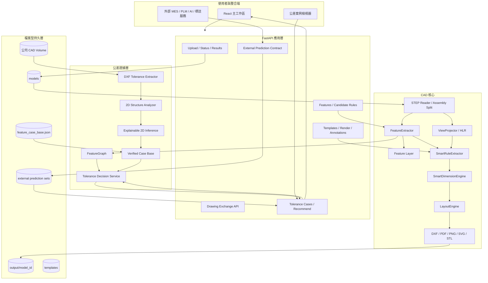
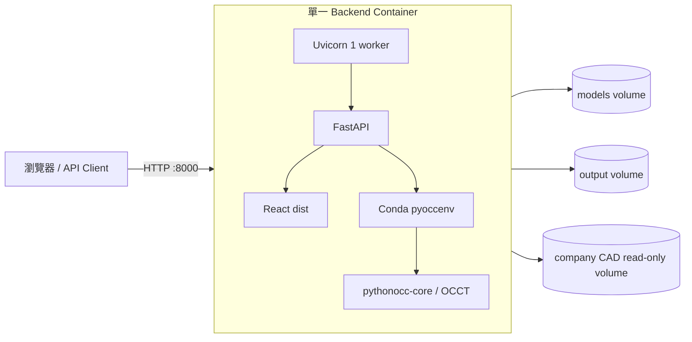
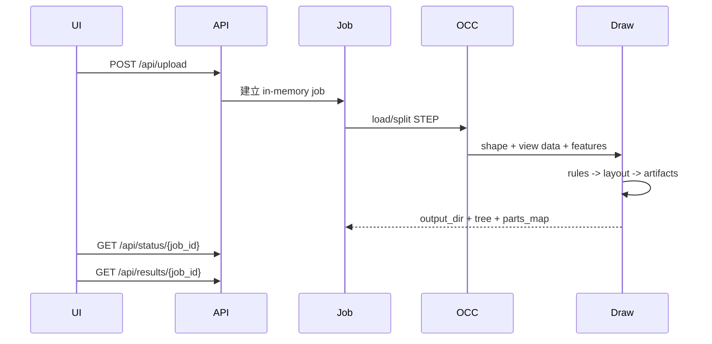
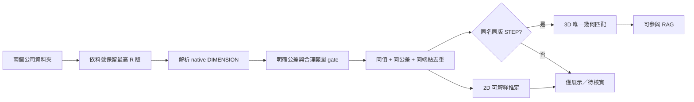

# 系統架構與模組邊界

本文件描述 STEP-to-2D 系統的執行架構、資料流、模組責任與持久化邊界。它是新成員理解程式碼的第一份技術文件；公差策略、繪圖細節與 API 契約分別由其他文件維護。

## 1. 架構目標

系統將一個 CAD 模型處理問題拆成五個可獨立驗證的階段：

1. **模型輸入與組合件解析**：安全接收 STEP/STP，建立組合件樹與零件檔。
2. **幾何理解**：以 OpenCASCADE B-Rep 分析 3D 曲面、拓撲與主軸。
3. **投影與標註規則**：產生第三角投影與可配置的候選尺寸。
4. **工程圖繪製**：將已選規則排版為 DXF，再衍生 PDF/PNG/SVG。
5. **公差證據與推薦**：將歷史圖面公差綁定到同一特徵分類，僅使用合格證據推薦。

核心設計原則是「幾何事實、推定結果、工程師決策分離」。模型曲面與尺寸是事實；特徵角色與 2D 分類可能是推定；最終公差必須保留來源、信心與是否經人工／3D 核實。

## 2. 邏輯架構圖

## 3. 部署架構

目前建議單一 Uvicorn worker，因為：

- `jobs`、全域公差設定與部分服務物件存在程序記憶體。
- 多 worker 會造成不同請求看到不同的 job 狀態。
- CAD 計算已透過應用內 `ThreadPoolExecutor` 執行背景工作。

生產化後應先把 job queue 與狀態移至 Redis/資料庫，再擴充多 worker。

## 4. 模組責任

### 4.1 `web_app/backend/server.py`

應用組裝層，負責：

- FastAPI 路由、CORS、靜態檔案與 OpenAPI。
- 檔案上傳、背景 job、結果查詢。
- 將安全的 `model_id`、`part_id` 映射到輸出目錄。
- 呼叫特徵、智慧標註、繪圖與公差服務。
- 提供公差來源圖面 SVG/PDF 與 entity highlight。
- 以獨立 prediction set 保存外部神經模型輸出，並與 CAD-RAG 並列回傳，不混入已核實案例庫。

不應把新的幾何演算法直接堆在 route function；幾何邏輯應進入 `auto_2d_drawing/` 的獨立服務。

### 4.2 `step_reader.py` 與 `batch_generate.py`

`step_reader.py` 是 CAD 輸入層：

- 使用 STEPControl/XCAF 讀取 STEP。
- 拆解組合件、命名零件、輸出 `_parts`。
- 建立 STL 與 assembly tree。

`batch_generate.py` 是工作流調度器：

- 對組合件與個別零件執行分類、投影、標註與匯出。
- 透過 callback 回報進度給 Web job。
- 建立後端可重新載入的檔案命名結構。

### 4.3 `feature_extractor.py`、`feature_layer.py` 與 FeatureGraph

- `FeatureExtractor` 讀取 TopoDS shape，提取曲面類型、半徑、方向、端面與包絡。
- `feature_layer.py` 將幾何事實轉成前端可視化 record。
- `tolerance/feature_graph.py` 將公差推薦所需的特徵轉成節點與鄰接資訊。

三者共享相同的核心分類語意，但輸出目的不同：視覺 record 給 UI；FeatureGraph 給檢索與決策。

### 4.4 `view_projector.py`

- 以 OpenCASCADE HLR 計算指定方向投影。
- 區分 visible/hidden edge。
- 產生 front/top/right/left/back 等 view data。
- 下游不應假設每個模型一定有所有視圖，應以回傳內容為準。

### 4.5 新舊標註引擎邊界

- `dimension_engine.py` 與舊 `extractors/` 是相容性保護區，不修改既有邏輯。
- 新功能放在 `smart_extractors/smart_rule_engine.py`、`smart_annotation_engine.py` 與獨立模組。
- `SmartRuleExtractor` 生成候選規則；`SmartDimensionEngine` 消費使用者確認後的設定。
- `LayoutEngine` 是共用的 2D 尺寸排版核心。

### 4.6 公差模組

| 模組 | 責任 |
| --- | --- |
| `dxf_tolerance_extractor.py` | 解析 DXF dimension、文字、公差模式與驗證狀態 |
| `dxf_structure_2d.py` | 尺寸點到 2D 幾何附著、視圖群與跨視圖線對 |
| `feature_inference_2d.py` | 可解釋的 2D 特徵候選與信心，不宣稱 3D identity |
| `ingest_historical_data.py` | 最新版篩選、去重、STEP 核實、重建案例庫 |
| `case_base.py` | 案例 schema、資格過濾、相似案例排名 |
| `tolerance_decision_service.py` | Tier 1～3 決策、相容性 gate、證據 trace |
| `iso_tolerance_table.py` | ISO fit 上下偏差查表 |

## 5. 資料生命週期

### 5.1 新模型產圖

### 5.2 歷史公差入庫

## 6. 核心資料物件

### FeatureRecord

3D/2D UI 使用的特徵表達，常見欄位：`id`、`type`、`name`、`role`、`nominal`、`geometry`、`source`、`view`。

### CandidateRule

可配置的尺寸規則，常見欄位：`rule_id`、`dim_type`、`nominal_value`、`views`、`side`、`prefix`、`tolerance_config`、`geometry_payload`。

### DimensionTask

繪圖前的正規化任務，含尺寸種類、端點／中心、數值、文字、公差、視圖與排版側向。

### FeatureNode

公差檢索用 3D 節點，含 canonical `feature_type`、公稱尺寸、軸向區間、鄰居、邊界位置及推定角色。

### ToleranceCase

歷史證據單位，包含來源圖面、公差設定、特徵類型、驗證狀態、信心與 `source_metadata`。只有 `ENGINEER_VERIFIED` 或符合嚴格規則的 `AUTO_VERIFIED` 可預設進入推薦。

## 7. 持久化與狀態

| 資料 | 位置 | 特性 |
| --- | --- | --- |
| 上傳 STEP | `models/` 或 `CAD_MODELS_DIR` | 檔案持久化 |
| 產圖結果 | `auto_2d_drawing/output/` 或 `CAD_OUTPUT_DIR` | 檔案持久化 |
| Job 狀態 | `server.py` 的 `jobs` | 記憶體，重啟消失 |
| 標註樣板 | templates 目錄 | JSON 檔案 |
| 外部 annotations | `output/{model_id}/_annotations/` | JSON 檔案 |
| 公差案例庫 | `tolerance/data/feature_case_base.json` | JSON，目前隨專案部署 |
| SVG/PDF cache | `tolerance/data/*_cache/` | 可重建快取 |

## 8. 邊界與安全

- `_safe_output_dir`、`_safe_part_id` 防止 path traversal；新增檔案 API 必須使用相同策略。
- 原始公司資料在 Docker 中應 read-only 掛載。
- `/api/tolerance/open-local` 只適用可信 Windows 桌面部署，不是遠端多租戶 API。
- 現行 CORS 開放是開發設定；正式部署應限制可信 origin。
- 上傳大小、檔名正規化、認證、授權、審計與 rate limit 尚待產品化。

## 9. 不可破壞的工程約束

1. 不修改舊版 `dimension_engine.py` 與舊 `extractors/` 行為。
2. 不使用特定零件的硬編碼中心座標。
3. 未核實 2D 猜測不得靜默變成可推薦歷史案例。
4. UI 維持純色深色 CAD 主題，不使用裝飾性 Emoji 或漸層。
5. API schema 或語意變更必須同步文件、OpenAPI 與更新日誌。
