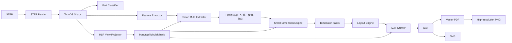

# 繪圖、投影與智慧標註引擎

本文件說明從 STEP shape 到 DXF/PDF/PNG/SVG 的完整繪圖策略，以及舊版與新版標註引擎的責任邊界。

## 1. 管線總覽



## 2. STEP 與組合件

`step_reader.py` 使用 OpenCASCADE 讀取 STEP roots。組合件模式會：

- 建立節點樹。
- 將 individual solid/part 寫到 `_parts`。
- 產生 `_full_assembly.stp` 與 STL。
- 保存 assembly tree，供前端模型目錄與外部 API 使用。

`batch_generate.py` 對 full assembly 及可繪製零件執行工程圖管線，並以 callback 回報進度。

## 3. 零件分類

分類器用幾何比例、圓柱／平面／孔洞數量與模型結構將零件送入對應策略，常見類型：

- `FAN`
- `FAN_HOUSING`
- `STAMPED_FAN_BASE`
- `SHAFT`
- `GENERIC`

分類結果影響視圖選擇、候選特徵優先度、標題欄內容與預設尺寸，但不應改變底層幾何事實。

## 4. HLR 投影

`ViewProjector` 使用 OpenCASCADE Hidden Line Removal：

- 前視：依系統定義的 view direction 與 up vector。
- 俯視：第三角投影位置。
- 右／左視：依零件與工作區需求。
- 後視：部分外框或沖壓件。

輸出 view data 通常包含：

- visible edges。
- hidden edges。
- circles/arcs。
- 視圖 bounds、中心與 scale 參考。

投影是幾何步驟，不直接決定哪些尺寸必須標註。

## 5. Candidate Rule

`SmartRuleExtractor` 將 3D feature 與 2D view data 轉為可配置規則。概念 schema：

```json
{
  "rule_id": "shaft_segment_03_diameter",
  "name": "軸段直徑 Φ10.00",
  "category": "shaft",
  "dim_type": "DIAMETER",
  "nominal_value": 10.0,
  "default_prefix": "Φ",
  "default_tolerance": "",
  "tolerance_config": {"mode": "NONE"},
  "target_views": ["front", "top"],
  "views": ["front"],
  "side": "LEFT",
  "rank": 1,
  "enabled": true,
  "geometry_payload": {}
}
```

重要區分：

- `target_views` 是允許／建議視圖。
- `views` 是工程師實際選取視圖。
- `default_tolerance` 是預設顯示，不等於歷史案例推薦。
- `tolerance_config` 是結構化公差，優先於只含文字的 tolerance。

## 6. SmartDimensionEngine

新版引擎負責把 configured rules 轉成 `DimensionTask`：

- 依每個 `views` 展開多個投影任務。
- 將 3D 軸向區間轉到目標 view 的 2D endpoint。
- 直徑、半徑、倒角、角度與線性尺寸採不同 payload。
- 保留 prefix、fit class、上下偏差與自訂文字。
- 將排版側向與 rank 傳給 LayoutEngine。

### 舊版保護

`dimension_engine.py` 與舊 `extractors/` 為既有相容流程。新功能不得直接修改其判斷；應擴充 smart engine 或新增獨立 adapter。

## 7. LayoutEngine

排版引擎將任務分流：

| 類型 | 主要策略 |
| --- | --- |
| 水平線性尺寸 | 上／下雙向 baseline、分層間距、串聯與總長 |
| 垂直線性尺寸 | 左／右 baseline、板厚與高度 |
| 直徑 | 視圖左側 leader 或圓視圖 polar leader |
| 半徑／倒角 | leader 與文字避讓 |
| 中心線 | 旋轉中心、孔中心與超出輪廓延伸 |

排版輸入必須是模型與視圖動態座標。禁止以某個測試模型的固定點作為 anchor。

### 防重疊策略

- 依 side 分組。
- 依幾何 span、rank 與重要性排序。
- 尺寸層使用固定的工程間距，但基準點由 view bounds 計算。
- 文字 bbox 與既有 annotation 區域衝突時向外推層。
- diameter/leader 使用角度或序列分散。

## 8. DXF 圖層

預設圖層語意：

| Layer | 用途 |
| --- | --- |
| `VISIBLE` | 可見輪廓 |
| `HIDDEN` | 隱藏線 |
| `CENTER` | 中心線 |
| `DIM` | 尺寸線與箭頭 |
| `DIM_TEXT` | 尺寸文字 |
| `TOLERANCE` | 公差文字 |
| `BORDER` | 圖框 |
| `TEXT` / `NOTES` | 一般文字與註記 |
| `HATCH` | 剖面線 |
| `FEATURE` | 特徵輔助圖層 |

`DxfDrawer` 負責建立缺失 linetype、style 與 layer，避免在 AutoCAD 或 ezdxf render 時因資源不存在而失敗。

## 9. 圖框與標題欄

- 支援 A4/A3/A2 紙張設定。
- 預設 A3、第三角投影。
- 標題欄可接收 `title_info`，例如料號、品名、材質、比例、版次。
- 一般公差表是圖面層級資訊，不應被誤認為每一個 feature 的獨立公差。

## 10. 匯出格式

### DXF

主要工程交換格式，保留向量、layer、dimension 與 entity handle。外部 CAD 軟體相容性以 DXF 為主要驗收對象。

### PDF

由向量管線產生，供瀏覽與列印。公差案例檢視器以 `Content-Disposition: inline` 回傳，避免瀏覽器強制下載。

### PNG

由 PDF 或向量畫布以較高 DPI rasterize，供首頁預覽與快速顯示，不應作為精密幾何交換來源。

### SVG

供 Web 縮放與公差 entity highlight。公差檢視器能用 query `highlight={handle}` 標出特定尺寸。

### STL

供 Three.js 顯示 3D 模型與比較視圖；STL 沒有 B-Rep feature identity，後端幾何分析仍使用 STEP。

## 11. 樣板

標註樣板保存使用者偏好：

- 啟用的 feature/rule 類型。
- 視角分配。
- 公差或前綴設定。
- side、rank 與其他呈現偏好。

樣板是設定重用，不是已核實歷史公差案例。套用樣板不會自動建立 `ENGINEER_VERIFIED` 案例。

## 12. 前端互動

智慧標註工作區包含：

- 3D STL orbit/zoom/pan。
- ISO、front、top、right 與 fit 相機切換。
- feature bbox hover/select。
- 右側規則搜尋、分類、選取與多視角按鈕。
- CAD-RAG 公差推薦與來源案例說明。
- 產圖進度、2D pan/zoom、返回 3D。
- DXF/PDF/SVG 開啟與下載。

## 13. 已知限制

- 部分複雜組合件的投影與標註數量仍需降噪。
- 文字碰撞採規則式排版，尚不是全域 constraint solver。
- GD&T feature control frame、datum scheme 與 surface finish 尚未完整生成。
- 字型依賴 Windows Microsoft JhengHei；Docker 改用 Noto CJK，字寬可能略有差異。
- PNG/PDF 後端依系統圖形與字型套件，容器需保留相關 runtime library。

## 14. 測試建議

每次修改繪圖引擎至少驗證：

1. STEP 可讀取且 assembly tree 正常。
2. 所需視圖存在且 bounds 合理。
3. DXF 可由 ezdxf 重新讀回。
4. layer、linetype 與 dimension style 完整。
5. PDF 可 inline 開啟。
6. PNG/SVG 無 404。
7. 不同姿態模型的 feature bbox 與實體對齊。
8. 舊版引擎結果未被新功能破壞。
