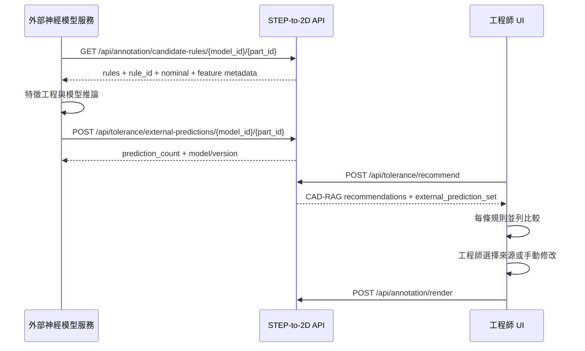

# 外部神經網路公差預測接入規格

本文件定義獨立神經網路模型如何把公差預測送入 STEP-to-2D 系統，並與既有的歷史案例／CAD-RAG 推薦並列顯示，讓工程師逐條選擇採用來源。

> 外部預測永遠保持獨立來源：提交預測不會寫入已核實歷史案例庫、不會覆蓋 CAD-RAG 結果，也不會自動成為工程圖最終公差。只有工程師在 UI 選擇後，才會套用到當前標註規則。

## 1. 整合目標

同一條 `rule_id` 可以同時看到：

1. **歷史案例／工程規則**：本系統以 FeatureGraph、已核實公司案例與 Tier 1～3 規則產生。
2. **外部神經網路預測**：由獨立模型提交，保存模型版本、信心、不確定性、輸入摘要與解釋。
3. **人工設定**：工程師直接修改公差。

UI 不會把三者合併成一個不透明分數。工程師可以選擇：

- `HISTORICAL_RAG`
- `EXTERNAL_NEURAL_MODEL`
- `MANUAL`

## 2. 整合時序



## 3. 前置資料

外部模型需要：

- `model_id`：完成產圖的輸出模型 ID。
- `part_id`：零件 ID。
- `rule_id`：候選標註規則的穩定對應 key。

取得 candidate rules：

```http
GET /api/annotation/candidate-rules/M_batch/Part_1
```

外部模型應把預測綁定 `rule_id`，不要只用陣列順序，因為規則數量與排序可能隨版本改變。

## 4. 提交預測

### Endpoint

```http
POST /api/tolerance/external-predictions/{model_id}/{part_id}
Content-Type: application/json
```

POST 採「整批取代」語意：同一 `model_id + part_id` 再次提交會原子替換上一批 prediction set。

後端會重新取得此零件的 candidate rules，若任何 `rule_id` 不在目前規則集合中，整批以 `422` 拒絕。此檢查不可由呼叫端停用。

正式環境應設定 `CAD_EXTERNAL_PREDICTION_API_KEY`。設定後，POST/GET/DELETE 都必須傳 `X-API-Key` header；未設定時維持本機開發相容模式。API key 只解決此接口的基本服務驗證，仍建議由反向代理提供 TLS、來源 allowlist、輪替與稽核。

### Request schema

```json
{
  "schema_version": "1.0",
  "provider": "tolerance-ml-service",
  "model_name": "ToleranceNet",
  "model_version": "2026.09.1",
  "model_artifact_id": "sha256:0123456789abcdef",
  "request_id": "pred-6bb5659c",
  "training_data_scope": "shaft-and-bearing-features-v3",
  "predictions": [
    {
      "rule_id": "shaft_segment_01_diameter",
      "feature_id": "shaft_segment_01",
      "predicted_mode": "FIT",
      "tolerance_config": {
        "mode": "FIT",
        "fit_class": "h6",
        "is_hole": false,
        "upper_dev": 0.0,
        "lower_dev": -0.009
      },
      "formatted_display": "h6 (+0.000 / -0.009 mm)",
      "confidence": 0.87,
      "explanation": [
        "輸入特徵分類為 shaft_segment",
        "公稱直徑 10 mm 位於模型訓練涵蓋區間",
        "鄰接定位肩特徵提高 h6 類別機率"
      ],
      "input_features": {
        "feature_type": "shaft_segment",
        "dimension_role": "DIAMETER",
        "nominal_value_mm": 10.0,
        "length_mm": 8.0,
        "neighbor_types": ["locating_shoulder"],
        "product_family": "FQ6V"
      },
      "uncertainty": {
        "method": "deep_ensemble",
        "entropy": 0.21,
        "top_classes": [
          {"label": "h6", "probability": 0.87},
          {"label": "g6", "probability": 0.08},
          {"label": "NONE", "probability": 0.05}
        ]
      },
      "warnings": [
        "尚未納入材料與配合件資訊"
      ]
    }
  ],
  "metadata": {
    "inference_runtime_ms": 18,
    "feature_pipeline_version": "feature-vector-v4",
    "calibration_dataset": "holdout-2026q3"
  }
}
```

### 欄位規格

#### Prediction set

| 欄位 | 類型 | 必填 | 說明 |
| --- | --- | --- | --- |
| `schema_version` | string | 否 | 預設且目前只接受 `1.0` |
| `provider` | string | 是 | 服務／組織識別，不放人名 |
| `model_name` | string | 是 | 模型名稱 |
| `model_version` | string | 是 | 可重現的模型版本，不使用 `latest` |
| `model_artifact_id` | string/null | 否 | checksum、registry digest 或 run ID |
| `request_id` | string/null | 否 | 呼叫端 trace ID |
| `training_data_scope` | string/null | 否 | 模型適用資料範圍 |
| `predictions` | array | 是 | 至少一筆，`rule_id` 不可重複 |
| `metadata` | object | 否 | runtime、校準資料、pipeline 版本等 |

#### 每筆 prediction

| 欄位 | 類型 | 必填 | 說明 |
| --- | --- | --- | --- |
| `rule_id` | string | 是 | 必須對應 candidate rule |
| `feature_id` | string/null | 否 | 若模型知道 FeatureGraph node，可提供 |
| `predicted_mode` | enum | 否 | `FIT`、`CUSTOM_SYMMETRIC`、`CUSTOM_LIMITS`、`GROOVE`、`NONE` |
| `tolerance_config` | object | 條件必填 | 除 `NONE` 外必填，且 `mode` 必須和 `predicted_mode` 一致 |
| `formatted_display` | string/null | 否 | UI 顯示，不作計算唯一來源 |
| `confidence` | number | 是 | 0～1，應為已校準信心而非任意 score |
| `explanation` | string[] | 否 | 可理解的主要依據 |
| `input_features` | object | 否 | 實際送入模型的重要特徵摘要 |
| `uncertainty` | object | 否 | entropy、variance、top classes、OOD 等 |
| `warnings` | string[] | 否 | 缺資料、超出訓練範圍、不可自動採用等 |

## 5. 公差模式

### FIT

```json
{
  "mode": "FIT",
  "fit_class": "H7",
  "is_hole": true,
  "upper_dev": 0.015,
  "lower_dev": 0.0
}
```

fit class 大小寫具有孔／軸語意，必須正確保存。

### CUSTOM_SYMMETRIC

```json
{"mode": "CUSTOM_SYMMETRIC", "dev": 0.05}
```

### CUSTOM_LIMITS

```json
{"mode": "CUSTOM_LIMITS", "upper_dev": 0.02, "lower_dev": -0.01}
```

### GROOVE

```json
{"mode": "GROOVE", "upper_dev": 0.04, "lower_dev": 0.0}
```

### NONE

```json
{"mode": "NONE"}
```

`NONE` 表示模型不建議 feature-specific 公差或選擇拒答；不要用虛構公差填補。

## 6. 成功回應

```json
{
  "status": "ok",
  "model_id": "M_batch",
  "part_id": "Part_1",
  "source_type": "EXTERNAL_NEURAL_MODEL",
  "provider": "tolerance-ml-service",
  "model_name": "ToleranceNet",
  "model_version": "2026.09.1",
  "prediction_count": 12,
  "received_at_utc": "2026-09-23T08:00:00+00:00"
}
```

後端會新增 `source_type`、`model_id`、`part_id` 與 server receipt time。

## 7. 讀取預測

```http
GET /api/tolerance/external-predictions/{model_id}/{part_id}
```

Response 會同時包含原始 `predictions` 與方便 UI 使用的：

```json
{
  "predictions_by_rule": {
    "shaft_segment_01_diameter": {
      "rule_id": "shaft_segment_01_diameter",
      "confidence": 0.87
    }
  }
}
```

沒有預測時回 `404`，不是空陣列。

## 8. 刪除預測

```http
DELETE /api/tolerance/external-predictions/{model_id}/{part_id}
```

只刪除此零件的外部 prediction set，不影響歷史案例與 CAD-RAG。

## 9. 與 CAD-RAG 一起讀取

主 UI 呼叫：

```http
POST /api/tolerance/recommend
```

Response 新增：

```json
{
  "recommendations": {
    "shaft_segment_01_diameter": {
      "retrieval_trace": {"decision_source": "HISTORICAL_CASE"}
    }
  },
  "external_prediction_set": {
    "source_type": "EXTERNAL_NEURAL_MODEL",
    "model_name": "ToleranceNet",
    "model_version": "2026.09.1",
    "predictions_by_rule": {}
  }
}
```

兩者是並列欄位。後端不會平均 confidence、不會投票、不會自動選較高分。

## 10. 工程師選擇與保存

UI 在每條 rule 顯示：

- 歷史案例／工程規則的 tier、案例、理由與信心。
- 外部模型的版本、預測、信心、解釋、不確定性與 warnings。
- 「歷史案例／工程規則」與「神經網路預測」選擇按鈕。

選擇後 `ruleConfig` 保存：

```json
{
  "tolerance_source": "EXTERNAL_NEURAL_MODEL",
  "tolerance_config": {"mode": "FIT", "fit_class": "h6"},
  "external_prediction_metadata": {
    "provider": "tolerance-ml-service",
    "model_name": "ToleranceNet",
    "model_version": "2026.09.1",
    "confidence": 0.87
  }
}
```

若工程師手動修改公差，來源改為 `MANUAL`。

只有工程師主動執行「存為案例」後，結果才以 `ENGINEER_VERIFIED` 進入歷史案例庫，並保留原始 decision source metadata。

## 11. Python 呼叫範例

```python
import requests

base_url = "http://localhost:8000"
model_id = "M_batch"
part_id = "Part_1"

rules = requests.get(
    f"{base_url}/api/annotation/candidate-rules/{model_id}/{part_id}",
    timeout=60,
).json()["rules"]

predictions = []
for rule in rules:
    rule_id = rule.get("rule_id") or rule["id"]
    # Replace with real feature preprocessing and neural inference.
    predictions.append({
        "rule_id": rule_id,
        "predicted_mode": "NONE",
        "tolerance_config": {"mode": "NONE"},
        "formatted_display": "拒答／沿用工程規則",
        "confidence": 0.20,
        "explanation": ["示例程式未執行模型推論"],
        "input_features": {
            "dim_type": rule.get("dim_type"),
            "nominal_value": rule.get("nominal_value"),
            "category": rule.get("category"),
        },
        "warnings": ["此為 API 格式示例，不是有效預測"],
    })

payload = {
    "schema_version": "1.0",
    "provider": "tolerance-ml-service",
    "model_name": "ToleranceNet",
    "model_version": "2026.09.1",
    "model_artifact_id": "sha256:replace-me",
    "predictions": predictions,
    "metadata": {"feature_pipeline_version": "v1"},
}

response = requests.post(
    f"{base_url}/api/tolerance/external-predictions/{model_id}/{part_id}",
    json=payload,
    timeout=60,
)
response.raise_for_status()
print(response.json())
```

## 12. curl 範例

```bash
curl -X POST \
  http://localhost:8000/api/tolerance/external-predictions/M_batch/Part_1 \
  -H "Content-Type: application/json" \
  -H "X-API-Key: $CAD_EXTERNAL_PREDICTION_API_KEY" \
  --data @external_predictions.json
```

## 13. 驗證錯誤

| HTTP | 原因 |
| ---: | --- |
| 400 | 同一批出現重複 `rule_id` |
| 401 | 已設定 API key，但 header 缺少或不相符 |
| 404 | `model_id` output 不存在，或 GET/DELETE 找不到 prediction set |
| 422 | 必填欄位缺少、mode/config 不一致、confidence 超出 0～1、predictions 空陣列或 strict rule 驗證失敗 |
| 500 | 檔案寫入或未處理錯誤 |

未知的 `rule_id` 預設不會保存；錯誤回應的 `detail.unknown_rule_ids` 會列出無法對應的值。整合端仍應先取得同一 `model_id + part_id` 的 candidate rules，避免不必要的推論與重試。

## 14. 黑箱風險控制要求

正式提交不應只有 class 與 confidence。至少建議提供：

- 確切模型版本與 artifact digest。
- 實際重要輸入特徵值。
- 訓練資料適用範圍。
- calibration 方法與資料集版本。
- top-k 類別或回歸區間。
- OOD／缺欄位警告。
- 不確定性估計。
- 允許模型拒答。

`explanation` 是模型服務提供的說明，STEP-to-2D 不會把它改寫成已證實的工程事實。

## 15. 信心值規範

`confidence` 必須在 0～1，但數值可比較的前提是校準一致。建議：

- 分類：temperature scaling、isotonic 或 calibration curve。
- 回歸：prediction interval、ensemble variance 或 conformal interval。
- 每個 feature family 分開報告校準。
- 不使用 softmax 最大值直接冒充可靠概率。
- UI 不比較 CAD-RAG confidence 與 neural confidence 的大小來自動選擇，因為兩者定義不同。

## 16. 資料與版本相容

- `schema_version=1.0` 期間，新增 optional field 視為相容。
- `rule_id` 必須來自相同 model/part 的 candidate rules。
- 模型服務應保存收到的 rule schema 版本。
- POST 是 whole-set replacement；要部分更新時，先 GET、合併後再 POST。
- Prediction set 儲存在 `output/{model_id}/_external_tolerance_predictions/{part_id}.json`。

## 17. 上線前驗收清單

- [ ] 可取得 candidate rules。
- [ ] 每筆預測有唯一 `rule_id`。
- [ ] `model_version` 可追溯，不使用浮動名稱。
- [ ] 所有 confidence 在 0～1。
- [ ] tolerance mode 與 config 一致。
- [ ] FIT 的孔／軸大小寫正確。
- [ ] 缺資料與 OOD 能拒答或 warnings。
- [ ] GET 可讀回完全相同的 prediction set。
- [ ] `/api/tolerance/recommend` 同時回傳兩種來源。
- [ ] UI 可逐條切換來源。
- [ ] 手動修改後來源變成 `MANUAL`。
- [ ] 未經工程師確認不會進 verified case base。
