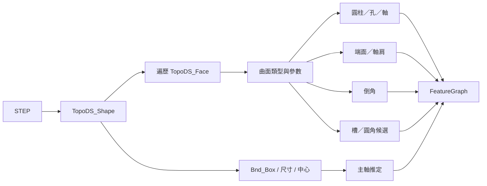

# 特徵查找引擎：3D 拓撲、2D 圖面與相似案例

本文件說明系統如何回答三個不同問題：

1. STEP 模型中有哪些幾何特徵？
2. DXF 的某一個尺寸可能指向哪一類特徵？
3. 新模型的特徵可以參考哪些歷史公司案例？

三者不能混為一談。3D B-Rep 能提供幾何 identity；2D 圖面通常只能提出候選；相似案例檢索則需要先有可信的共同特徵 taxonomy。

## 1. 統一特徵語意

公差與推薦使用 canonical feature type，主要包含：

- `shaft_segment`：外圓柱軸段。
- `hole`：內孔或孔段。
- `retaining_ring_groove`：卡簧／扣環槽。
- `locating_shoulder`：定位軸肩或台階。
- `pilot_chamfer`：導入倒角。
- `transition_fillet`：過渡圓角。

UI 可顯示較友善的名稱，但資料庫與相似度計算應保存 canonical type，避免同一概念被 `cylinder`、`journal`、`shaft` 等名稱拆散。

## 2. 3D 特徵提取管線



### 2.1 動態包絡與主軸

`FeatureExtractor` 先由 `Bnd_Box` 取得：

```text
[xmin, ymin, zmin, xmax, ymax, zmax]
```

中心為各軸上下界平均值，尺寸為上下界差。主軸判定綜合：

- 包絡長寬高比例。
- 圓柱面的軸向向量。
- 旋轉對稱特徵的共同方向。

所有特徵位置都由模型包絡、特徵自身幾何與主軸計算，不可用特定範例的固定中心。

### 2.2 曲面與拓撲

引擎遍歷 B-Rep face，讀取曲面種類與參數：

- 圓柱面：半徑、軸線、軸向範圍。
- 平面：法向量、位置、邊界。
- 圓錐面：半角、半徑變化與軸向。
- 圓環面／圓弧：主半徑、次半徑與鄰接面。

同一幾何尺寸可能出現在多個 face，因此需要以幾何範圍、中心、軸向與鄰接關係去重或分段。

### 2.3 內孔與外軸

相同半徑的圓柱面並不能只靠半徑判斷是孔或軸。3D 分類應參考：

- 面法向與 solid 內外關係。
- 圓柱是否位於外包絡邊界。
- 與端面、其他圓柱段的鄰接。
- 沿主軸的材料連續性與半徑階梯。

分類結果成為 FeatureGraph 節點；無法可靠判定時應保留一般圓柱候選，而不是強迫分到孔或軸。

## 3. FeatureGraph

FeatureGraph 是公差檢索的共同語言。每個節點至少描述：

```json
{
  "id": "shaft_segment_03",
  "feature_type": "shaft_segment",
  "nominal": {"diameter": 10.0, "length": 8.0},
  "axial_span": [12.0, 20.0],
  "center_axial": 16.0,
  "neighbor_types": ["locating_shoulder"],
  "boundary_position": "INTERIOR",
  "inferred_role": "BEARING_JOURNAL"
}
```

邊或鄰接欄位描述：

- 軸向前後相鄰。
- 同心／共軸。
- 由軸肩、槽或倒角分隔。
- 是否位於零件端部或內部。

相似案例不是只比「直徑差多少」，還要比較特徵類型、尺寸角色、鄰接拓撲、邊界位置、零件類型及產品家族。

## 4. 2D DXF 尺寸到特徵的推定

2D 圖面沒有完整材料內外與深度資訊，因此系統使用可解釋規則，不使用黑箱 YOLO 直接產生特徵 identity。

### 4.1 DXF 尺寸解析

`DxfToleranceExtractor` 優先解析原生 entity：

- `DIMENSION`
- `ARC_DIMENSION`
- `RADIAL_DIMENSION`
- `DIAMETER_DIMENSION`

讀取內容包括：

- entity handle、layer、dimension type。
- defpoint、defpoint2、defpoint3、defpoint4、text midpoint。
- nominal measurement。
- DIMSTYLE 上下偏差、對稱公差、limits。
- raw override text、fit class 與前綴。

文字型 `TEXT/MTEXT` 只作補充。標題欄的一般公差、重量、轉速等文字會分類為 drawing default 或 rejected，不當成某一個特徵公差。

### 4.2 驗證狀態

| 狀態 | 語意 |
| --- | --- |
| `AUTO_VALIDATED` | 原生尺寸、明確公差、數值與範圍合理 |
| `REVIEW_REQUIRED` | 有可能是尺寸／公差，但格式或語意不足 |
| `NO_TOLERANCE` | 尺寸存在但沒有明確公差 |
| `DRAWING_DEFAULT` | 圖面級未注公差，不綁定單一特徵 |
| `REJECTED` | 非尺寸、標題欄雜訊或不合理值 |

### 4.3 幾何附著

`DxfStructure2DAnalyzer` 優先使用 DXF 原生 associative handle；轉檔後常已遺失，所以另以 definition point 到幾何 primitive 的距離恢復關聯。

輸出包含：

- 每個 definition point 最近的 circle/line/polyline。
- exact attachment 與 nearby geometry。
- 共同附著 handle。
- 尺寸所屬的稀疏 view cluster。
- 幾何關聯信心與歧義狀態。

### 4.4 跨視圖推定

直徑尺寸在端視圖通常是圓，但只看圓無法分辨孔或軸。因此系統尋找另一視圖中距離等於直徑的平行線對：

- 對應最外可見輪廓，較支持 `shaft_segment`。
- 對應成對隱藏線，較支持 `hole`。
- 可見與隱藏同時存在、或不是外輪廓，保持候選而不唯一分類。

只有尺寸已可靠附著到圓輪廓，且跨視圖證據一致時，才可能得到 `AUTO_INFERRED_2D`。

### 4.5 文字與公差語意

- `H7` 等大寫孔公差帶支持 `hole`。
- `h6`、`g6` 等小寫軸公差帶支持 `shaft_segment`。
- 卡簧、扣環、groove 支持 `retaining_ring_groove`。
- 軸肩、台階、shoulder 支持 `locating_shoulder`。
- 倒角、chamfer 支持 `pilot_chamfer`。
- 圓角、fillet 支持 `transition_fillet`。

這些是可追蹤 evidence，不會只輸出一個無原因的 label。

### 4.6 2D 推定輸出

```json
{
  "method": "DXF_2D_RULES_V2",
  "status": "AUTO_INFERRED_2D",
  "feature_type": "shaft_segment",
  "confidence": 0.93,
  "margin": 0.25,
  "candidates": [
    {
      "feature_type": "shaft_segment",
      "confidence": 0.93,
      "evidence": ["尺寸已連到圓輪廓", "另一視圖有相同直徑外輪廓線對"]
    }
  ],
  "feature_identity_verified": false,
  "retrieval_eligible": false
}
```

即使是高信心 `AUTO_INFERRED_2D`，`feature_identity_verified` 仍為 false，因為它確認的是類型證據，不是 STEP 中某一個唯一 face。

## 5. STEP/DXF 幾何核實

歷史資料要成為自動推薦證據，現行 gate 要求：

1. STEP 與 DXF 為完全相同模型名稱及版次。
2. DXF 是原生、有效且含明確公差的尺寸。
3. dimension category 與 3D feature nominal field 相容。
4. 公稱值在動態 threshold 內相符。
5. STEP 中只有一個相容的 feature candidate。
6. 重複標註的公差設定一致。

若多個 3D 特徵具有相同值，結果是 ambiguous，不會任選一個。

## 6. 歷史版次與去重

檔名符合下列形式時，前段視為料號、尾端數字視為 revision：

```text
2FQ6V4030H-R00.dxf
2FQ6V4030H-R01.dxf
```

同一料號只選最高 `R` 版。同版出現在多個來源資料夾時，以穩定排序選一份；報告會保留被排除數量。

尺寸去重 signature 包含：

- dimension category。
- nominal value。
- tolerance config。
- 正規化量測端點。

因此同一張圖面上「同值但不同位置／方向」的工程尺寸不會被誤刪。

## 7. 相似案例搜尋

`FeatureCaseBase.search_similar_cases_detailed` 的概念性評分由以下因素組成：

- canonical feature type 是否一致。
- 尺寸角色是否相容，例如 diameter 不可拿 length 案例決策。
- nominal dimensions 的相對接近程度。
- neighbor feature type 重疊程度。
- boundary position 是否一致。
- part type 與 product family 是否一致。
- 案例 verification status 與 confidence。

檢索會先做資格與相容性 gate，再做排名。高相似度不能覆蓋「尺寸角色不相容」或「案例未核實」。

## 8. 覆蓋率與準確率

目前可以計算的是覆蓋率：多少尺寸被解析、多少有明確公差、多少能定位特徵、多少有 3D 核實。

目前不能宣稱整體準確率，因為尚缺足量的人工 ground truth。建立準確率需要：

1. 依產品家族分層抽樣。
2. 由工程師標註 dimension handle 對應的 feature type 與 3D face/segment。
3. 分別計算 precision、recall、coverage 與 ambiguous rate。
4. 對不同 dimension category 單獨報告。
5. 保存錯誤案例與規則版本，避免只報單一平均數。

## 9. 下一階段策略

- 建立 2D view 與 3D HLR 投影的 registration，將 DXF 尺寸點反投影到候選 3D edge/face。
- 使用 OCR/VLM 只處理爆炸尺寸、掃描 PDF、GD&T 框格與非原生文字；幾何 identity 仍由 CAD 約束驗證。
- 建立產品家族、料號與 revision 的顯式 model registry，不再只靠檔名交集。
- 提供工程師批次覆核 UI，將確認結果寫回 `ENGINEER_VERIFIED`。
- 建立 benchmark dataset 與離線評估報告，再決定是否導入 YOLO/圖神經網路。

## 10. 為什麼目前不直接使用 YOLO

YOLO 適合偵測圖面上的符號、文字框、GD&T frame 或尺寸區域，但無法單獨回答「這個尺寸對應哪一個 3D 拓撲特徵」。本系統目前優先使用 CAD entity、拓撲與幾何約束，原因是：

- DXF 已提供比像素更精確的向量與 entity handle。
- 工程需求需要可追溯到原始尺寸與幾何。
- 公差錯配的成本高，必須能解釋及拒答。

未來可將 YOLO/VLM 作為候選提取器，再由幾何引擎驗證，而不是直接把模型 label 當成工程事實。
