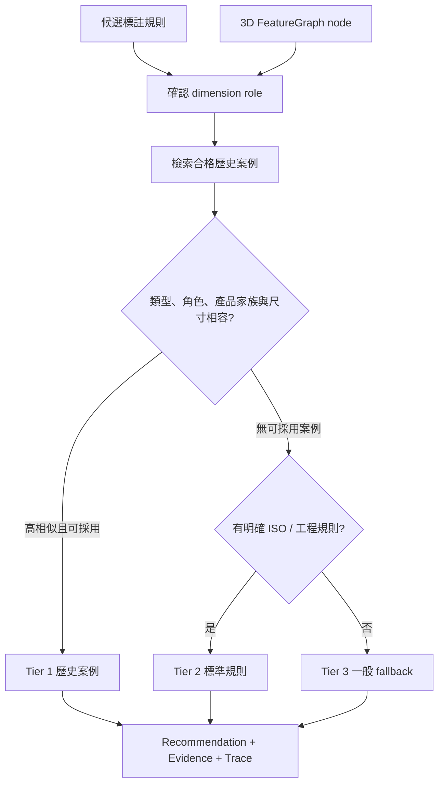

# CAD-RAG 智慧公差推薦系統

> 狀態：**開發中／實驗性功能**。目前已完成可追溯的推薦管線、證據資格隔離與 UI 顯示，但歷史案例的 3D 核實覆蓋率仍低。所有輸出應由工程師覆核，不可直接視為製造放行依據。

## 1. 系統要解決的問題

公差不應只由尺寸大小決定。工程師通常同時考慮：

- 特徵是孔、軸段、軸承位、定位肩、槽、倒角或一般長度。
- 特徵的功能角色與組裝需求。
- 鄰接特徵、端部／內部位置與產品家族。
- 公司過往同類產品的實際圖面。
- ISO fit、公差等級、製程能力與量測方式。

系統因此採用「3D FeatureGraph + 已核實歷史案例 + 規則 fallback」的分層策略，而不是要求 LLM 直接生成一個看似合理的公差值。

## 2. 決策總覽



## 3. 證據資格

### 3.1 可參與推薦

- `ENGINEER_VERIFIED`：工程師在 UI 或受控流程確認。
- `AUTO_VERIFIED`：同名同版 STEP/DXF，且尺寸種類、公稱值與唯一 3D 特徵一致。

### 3.2 不可直接參與推薦

- `AUTO_EXTRACTED`：公差確實來自 DXF，但 feature identity 未證明。
- `AUTO_INFERRED_2D`：2D 證據支持某一類型，但未綁定唯一 3D 特徵。
- `REVIEW_CANDIDATE`：需要工程師覆核。
- `UNRESOLVED`：資料不足。
- 種子、生成或規則案例：目前歷史公司案例庫不建立此類假資料。

這個隔離避免「有公差文字」被誤解為「知道它屬於哪個功能特徵」。

## 4. 三層推薦

### Tier 1：歷史案例採用

條件：

- 至少一個 retrieval-eligible 案例。
- feature type 與 dimension role 相容。
- 相似度達採用門檻。
- 不存在更高優先的安全阻擋條件。

輸出必須指出：

- `decision_source = HISTORICAL_CASE`
- `adopted_case_id`
- 案例來源圖面。
- similarity 與 score breakdown。
- `used_for_decision = true`
- 可點擊的 PDF/SVG/details URL（來源存在時）。

### Tier 2：標準／工程規則

當沒有可採用公司案例，但特徵角色有明確標準規則時使用。例如：

- 已知孔／軸 ISO fit class。
- 明確 groove、chamfer 或特定製程規則。
- 尺寸角色與 rule table 可唯一對應。

Tier 2 不是歷史案例命中。UI 與 API 必須標示其來源為標準／規則，不可假裝是公司圖面經驗。

### Tier 3：一般 fallback

無歷史案例且無專用規則時，保守回傳一般未注公差或低信心建議。這一層的目的是讓 UI 有明確「未能決策」狀態，而不是湊出高信心答案。

例如線性階梯長度若沒有相容歷史案例，可能回傳：

```json
{
  "tier_level": "TIER_3_GENERAL_FALLBACK",
  "recommended_mode": "NONE",
  "confidence": 0.35,
  "retrieval_trace": {
    "decision_source": "GENERAL_FALLBACK",
    "adopted_case_id": null
  }
}
```

## 5. 相似案例不是推薦結果

API 可能列出多個 `evidence_cases`，但每筆證據還有角色：

| 欄位／角色 | 語意 |
| --- | --- |
| `ADOPTED_HISTORICAL_CASE` | 實際被 Tier 1 採用 |
| `RETRIEVED_CANDIDATE` | 搜尋到但未採用 |
| `used_for_decision` | 是否真正決定輸出公差 |
| `used_as_context` | 是否只作解釋背景 |
| `same_product_family` | 是否同產品家族 |
| `score_breakdown` | 各相似度因子 |

前端不得只因案例被列出，就宣稱推薦源自該案例。

## 6. 相容性 Gate

### 6.1 尺寸角色

直徑與長度即使數值相同也不是同一決策問題：

- `shaft_segment.diameter` 可參考軸配合案例。
- `shaft_segment.length` 不可套用該軸徑 fit class。
- groove width 不可只因尺寸接近就套用 hole diameter。

### 6.2 Feature type

檢索前先正規化 type；未能正規化或類型不相容時，案例不可採用。

### 6.3 產品家族

同家族案例優先於跨家族。產品家族由料號規則推定，目前仍是 heuristic，未來應由 PLM/BOM 明確提供。

### 6.4 鄰接與邊界

內部軸承位、端部導角、卡簧槽附近的軸段功能不同；FeatureGraph 的 neighbor types 與 boundary position 會影響排名。

## 7. 公差資料結構

典型 `tolerance_config`：

```json
{
  "mode": "FIT",
  "fit_class": "h6",
  "is_hole": false,
  "upper_dev": 0.0,
  "lower_dev": -0.009,
  "source": "DXF_DIMSTYLE"
}
```

支援模式：

- `FIT`
- `CUSTOM_SYMMETRIC`
- `CUSTOM_LIMITS`
- `GROOVE`
- `NONE`

`NONE` 表示沒有 feature-specific 明確公差，可能沿用圖面一般公差；不等於系統已選定 `ISO 2768-m` 為唯一正確答案。

## 8. API 輸出應如何閱讀

`POST /api/tolerance/recommend` 的每個 recommendation 應同時閱讀：

- `tier_level`
- `recommended_mode`
- `formatted_display`
- `confidence`
- `reasoning`
- `retrieval_trace.decision_source`
- `retrieval_trace.adopted_case_id`
- `evidence_cases[]`
- `feature_graph`

若 `decision_source` 不是 `HISTORICAL_CASE`，即使 `evidence_cases` 有內容，也不能說「使用了過往案例的公差」。

## 9. UI 行為

智慧特徵標註的「一鍵智慧推薦公差」會：

1. 將目前 `model_id`、`part_id`、候選規則及產品類別送往後端。
2. 後端重新載入 STEP 並建立 FeatureGraph。
3. 每個規則執行 Tier 1～3 決策。
4. 前端將建議公差注入規則設定，但仍可由工程師修改。
5. 右側顯示參考案例、決策來源、理由與案例圖面連結。
6. 工程師確認後可透過 `save-case` 建立 `ENGINEER_VERIFIED` 案例。

## 10. 為什麼「為什麼」目前不需要 LLM

目前理由由決策 trace 與規則 evidence 組合，優點是：

- 每句理由對應明確程式條件。
- 可重現、可測試、沒有語言模型幻覺。
- 能區分採用案例、候選案例與 fallback。

LLM/VLM 可在未來用來把結構化 trace 改寫成更自然的說明，或閱讀掃描圖、GD&T/註記；但 LLM 不應創造不存在的案例、尺寸或公差。

建議模式：

```text
幾何／檢索引擎產生結構化事實
        ↓
LLM 僅摘要與解釋
        ↓
輸出同時附原始 trace，供稽核
```

## 11. 目前實際完成度

### 已完成

- 原生 DXF 公差提取與合理性 gate。
- 最高 R 版篩選與真正重複 entity 去重。
- 2D 可解釋候選推定。
- STEP/DXF 唯一值核實。
- 案例庫資格隔離。
- Tier 1～3 決策與 evidence trace。
- 前端推薦、案例列表及可點擊來源圖面。

### 仍在做

- 擴大 STEP/DXF 對應模型數。
- 尺寸到唯一 3D face/segment 的穩定 registration。
- 人工標註 ground truth 與 precision/recall 報告。
- GD&T、表面粗糙度、基準與註記解析。
- 製程能力、材料與供應商條件。
- 版本化、審核流、回滾與權限。

## 12. 目前資料基準與限制

最近一次完整重建：

- 掃描 1,744 個 DXF，選出 1,697 個最高版模型。
- 排除 47 個舊版／重複檔。
- 1,507 張圖有有效公差資料。
- 23,516 筆最終公差證據。
- 14 筆 STEP 核實案例可參與推薦。
- 37 筆 2D 高信心分類仍不直接進入 RAG。
- 833 筆待覆核候選。
- 22,648 筆仍無法可靠定位 feature identity。

這表示「公差值提取」已有大量資料，但「公差綁定到可靠 3D 特徵」仍是主要瓶頸。

## 13. 驗證與治理建議

正式使用前至少應完成：

1. 建立由工程師簽核的 benchmark。
2. 每種產品家族分開計算準確率與覆蓋率。
3. Recommendation 保存 engine version、case IDs、輸入 feature、輸出公差與人工最終值。
4. 公差案例修改需有使用者、時間、原因與前後差異。
5. 低信心或 fallback 在 UI 明確標示，不使用「AI 已確認」等字樣。
6. 與 PLM/BOM 串接材料、配合件與功能需求後再擴大自動採用。

## 14. 外部神經網路預測並列

系統提供獨立 prediction set API，讓神經模型依同一批 `rule_id` 提交公差、信心、不確定性、輸入摘要與解釋。它與 CAD-RAG recommendation 並列，不加入案例相似度、不覆蓋原推薦，也不自動選擇較高信心者。

工程師可逐條選擇 `HISTORICAL_RAG`、`EXTERNAL_NEURAL_MODEL` 或 `MANUAL`；完整契約與範例見[外部神經網路公差預測接入規格](external-tolerance-model-api.md)。
