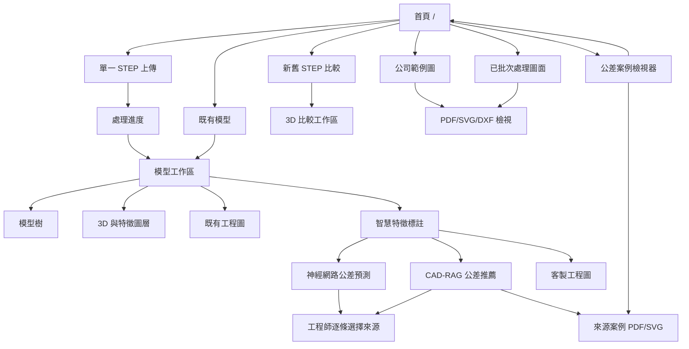

# 網站頁面、功能與頁面關係

Web 介面由 React 主工作區與獨立的公差案例檢視器組成，兩者共用同一個 FastAPI 後端與檔案服務。

## 1. 頁面地圖



## 2. 首頁 `/`

### 功能

- 單一模型轉換。
- 新舊版本 3D 比較。
- 載入既有模型輸出。
- 瀏覽公司範例圖。
- 瀏覽 FAN 批次處理結果。
- **開啟公差案例檢視器**。

### 公差入口

首頁的「開啟公差案例檢視器」按鈕連到：

```text
/tolerance-inspector.html
```

使用同源相對網址，因此可在 localhost、Docker、反向代理或其他 host 下正常工作。

## 3. 上傳與處理進度

### 單一模型

1. 選擇 `.stp` 或 `.step`。
2. `POST /api/upload` 取得 `job_id`。
3. 前端輪詢 `/api/status/{job_id}`。
4. 完成後讀取 `/api/results/{job_id}`。
5. 進入模型工作區。

Job 狀態存在後端記憶體，服務重啟後不能用舊 `job_id` 查詢；已寫入 output 的模型仍可從既有模型載入。

### 新舊版本比較

1. 分別選擇 old/new STEP。
2. `POST /api/compare`。
3. 輪詢狀態。
4. 顯示兩模型疊加、線框或 X 光滑桿。

目前紅／綠表示完整舊／新模型，不代表精準 Boolean 差集。

## 4. 模型工作區

### 頂部列

- 系統名稱與狀態。
- 完成零件數。
- 返回首頁。

### 左側模型目錄

- 組合件樹。
- `_full_assembly` 與個別零件。
- 切換零件時更新 STL、工程圖、feature records 與 candidate rules。

### 中央檢視區

依模式顯示：

- 3D STL。
- 3D 特徵包絡框。
- 原始工程圖 PDF/SVG。
- 智慧標註產生的客製工程圖 PNG/PDF/SVG。

3D 模式支援 orbit、pan、zoom、fit 及標準視角；2D 模式支援拖曳、縮放與 1x 重設。

### 圖面快捷連結

若輸出存在，顯示前視、後視、俯視、右視與左視圖連結。頁面不假設每個模型都有全部視圖。

## 5. 智慧特徵標註

### 3D 特徵圖層

- 彩色 bbox/線框對應後端 FeatureRecord。
- hover 與右側規則卡片聯動。
- 點擊可選取／取消 feature。

### 標註控制台

- 搜尋規則。
- 類型篩選。
- 選取／取消標註。
- 為單一規則選擇多個視圖。
- 設定公差、前綴、side 與其他參數。
- 回復系統建議預設。
- 保存、套用與刪除樣板。

### 產出標註工程圖

前端將目前選定的 configured rules 送至 `/api/annotation/render`。成功後顯示客製 PNG，並提供 DXF、PDF、SVG。

## 6. CAD-RAG 智慧公差推薦

> 此區塊目前仍在開發與驗證。

操作流程：

1. 先選定零件與標註規則。
2. 點選「一鍵智慧推薦公差（CAD-RAG／規則）」。
3. 後端載入 STEP、建立 FeatureGraph。
4. 每條規則回傳 Tier、信心、理由、檢索 trace 與案例。
5. 前端將 recommendation 顯示並注入規則設定。
6. 工程師仍可修改。
7. 工程師確認後才可保存為 verified case。

來源案例區需區分：

- 實際採用案例。
- 只被檢索到但未採用案例。
- 規則／一般 fallback。

有圖面的公司案例可點擊 PDF/SVG/details；不存在來源圖面時不得偽造連結。

## 7. 公差案例檢視器 `/tolerance-inspector.html`

### 統計列

- 尺寸／公差證據總數。
- 可參與 RAG 的已核實案例。
- 來源圖面數。
- 尚未定位 feature identity 的證據數。

### 清單

- 一張來源圖面顯示一張卡片。
- 卡片顯示該圖的公差尺寸筆數、已定位數及可參與推薦數。
- 支援分類、搜尋、分頁與縮圖。

### 圖面詳情

- PDF iframe 直接閱讀。
- SVG 向量圖與指定 DXF handle highlight。
- 每筆 nominal、category、公差、layer、raw text、validation status。
- 2D 推定候選、信心、關聯 handle、跨視圖 evidence。
- drawing default 與 rejected item 分區顯示。

### 與推薦系統的關係

Inspector 是資料品質與證據檢視頁，不直接代表案例都會進 RAG。只有顯示為 retrieval eligible 的案例才會被預設檢索。

## 8. 雙來源公差決策

外部神經網路可先用 `POST /api/tolerance/external-predictions/{model_id}/{part_id}` 提交一批與 `rule_id` 對應的預測。標註控制台重新執行推薦後，會同時顯示：

- 歷史案例／工程規則：可追溯檢索案例、相似度拆解、採用理由與 Tier。
- 神經網路預測：模型名稱、版本、信心、不確定性、說明與警告。
- 手動值：工程師直接修改後，來源標記為 `MANUAL`。

工程師需逐條點選來源；神經網路預測不會寫入歷史案例庫，也不會默默取代既有推薦。只有按下「存為案例」後，當下選定的值與來源 metadata 才會進入確認流程。完整接入契約見[外部神經網路公差預測接入規格](external-tolerance-model-api.md)。

## 9. 公司範例圖檢視器

首頁會合併：

- 專案 reference 目錄。
- `CAD_NEW_EXAMPLE_DIR` 指定的外部公司資料目錄。

檔案以樹狀結構顯示；PDF/SVG 可內嵌檢視，其他格式提供開啟／下載。Docker 中外部資料通常掛載於 `/data/company-reference`。

## 10. 頁面到 API 對照

| 頁面功能 | API |
| --- | --- |
| 首頁既有模型 | `GET /api/models` |
| 單一上傳 | `POST /api/upload` |
| 新舊比較 | `POST /api/compare` |
| 進度 | `GET /api/status/{job_id}` |
| 結果 | `GET /api/results/{job_id}` |
| 模型工作區 | `GET /api/model/{model_id}` |
| 3D 特徵 | `GET /api/features/{model_id}/{part_id}` |
| 候選標註 | `GET /api/annotation/candidate-rules/{model_id}/{part_id}` |
| 樣板 | `/api/annotation/templates*` |
| 客製出圖 | `POST /api/annotation/render` |
| 公差推薦 | `POST /api/tolerance/recommend` |
| 提交神經網路預測 | `POST /api/tolerance/external-predictions/{model_id}/{part_id}` |
| 查詢／移除神經網路預測 | `GET`, `DELETE /api/tolerance/external-predictions/{model_id}/{part_id}` |
| 保存公差案例 | `POST /api/tolerance/save-case` |
| Inspector 統計／清單 | `GET /api/tolerance/stats`, `GET /api/tolerance/cases` |
| Inspector 圖面 | drawing PDF/SVG/details APIs |
| 公司範例 | `GET /api/examples` |

## 11. UI 設計規範

- 背景：`#171717`、panel `#262626`。
- 主要動作：`#2563eb`。
- 錯誤、警告、成功以有限語意色使用。
- 不使用彩色 gradient。
- 不使用裝飾性 Emoji；圖示使用 `lucide-react`。
- 工程數值應標示單位、來源與驗證狀態。
- 未核實結果不能只顯示高信心百分比而省略狀態。

## 12. 錯誤處理

- API 失敗顯示後端 `detail`，但不要暴露不必要的本機路徑給一般使用者。
- PDF 不存在時應顯示可理解的空狀態，而非自動下載或空白 iframe。
- 圖面渲染失敗時保留 metadata 與 details，讓工程師仍可診斷。
- 長時間 CAD job 使用進度／輪詢，不讓頁面看起來無回應。

## 13. 待改善

- 將大型 `App.tsx` 拆成 route、workspace、viewer、annotation 與 API client。
- 導入正式 client-side routing，取代目前以 state 切換主要頁面。
- API base、認證與 error handling 集中管理。
- 建立 component test 與 E2E 流程。
- 加入公差案例批次覆核、接受／拒絕與 audit trail。
